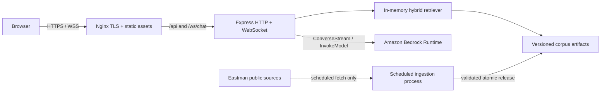
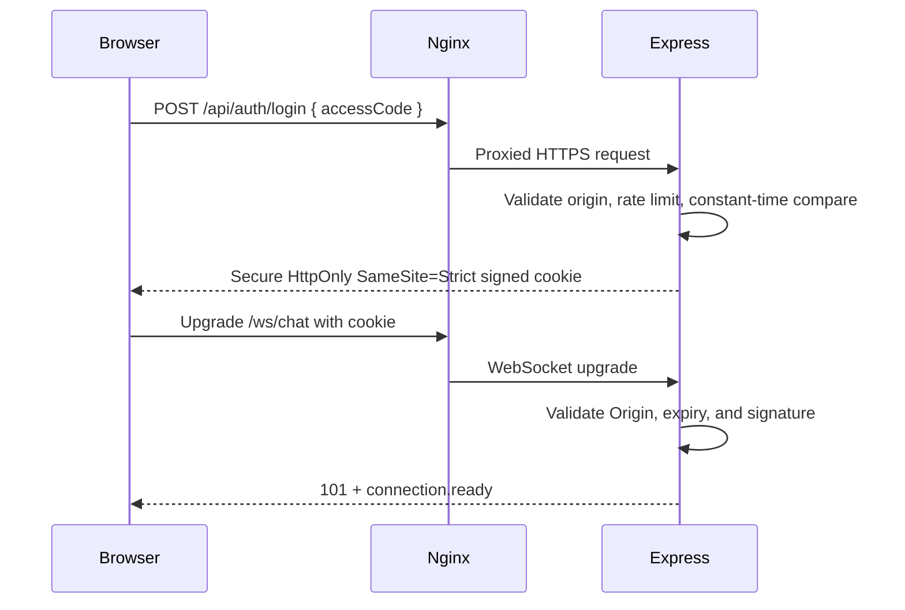
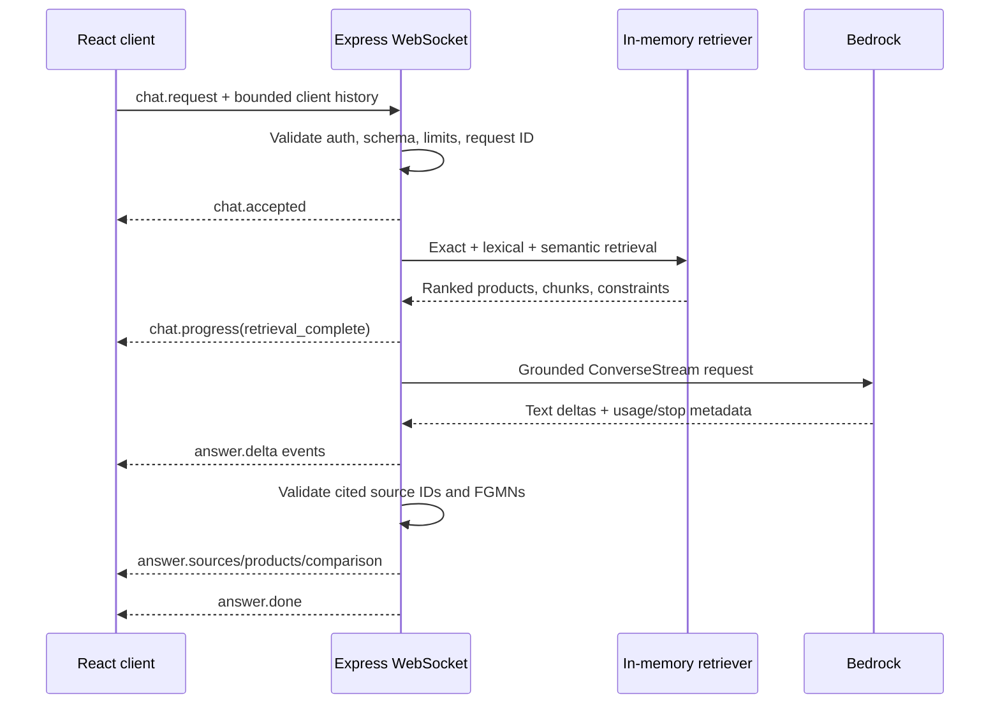

# Eastman AI Product Finder MVP — Knowledge Base

| Field         | Value                                                           |
| ------------- | --------------------------------------------------------------- |
| Purpose       | Canonical technical and product-discovery knowledge for the MVP |
| Last verified | 2026-08-30                                                      |
| Current phase | Discovery and architecture complete; implementation not started |
| Target stack  | React, Express, native WebSockets, Amazon Bedrock, EC2, Nginx   |
| Data policy   | No database and no persistent user/chat retention               |

## How to read this document

This file intentionally separates facts from design choices:

- **Verified** — observed in the repository, local catalog, Eastman public pages/endpoints, or current official AWS/Nginx documentation.
- **Decision** — explicitly selected for this MVP.
- **Recommendation** — the implementation approach chosen from the available options; validate it during delivery.
- **Open deployment value** — a value such as model ID, AWS Region, domain, or timeout that must be selected in the target AWS account.

Eastman endpoint behavior documented here was reverse-engineered from public web resources. It is not evidence of a supported or versioned public API contract. The ingestion pipeline must tolerate schema changes, failures, throttling, and removal of these resources.

## 1. Executive summary

### Verified

- The local Eastman snapshot contains **979 products** and five filter categories.
- Each product has a stable `FGMN` identifier, names, three document-availability flags, and a short description.
- The static products do **not** contain their own filter memberships.
- Eastman’s live product-finder component accepts filters in query parameters and returns a filtered product list with recomputed facet state/counts.
- Product detail, TDS, SDS selector, sales specification, and inquiry links follow verified patterns based on `FGMN` and an authored product slug.
- TDS pages contain useful structured product evidence. Final SDS files are selected by region/language and may be temporary.

### Decisions

- Build a standalone React + Express service using native WebSockets.
- Use Amazon Bedrock for generation and embeddings.
- Deploy one same-origin service on AWS EC2 behind Nginx.
- Use one shared test access code, exchanged for a short-lived secure cookie.
- Keep conversation history only in React memory and resend a bounded history with each request.
- Do not use a database or persist prompts, responses, histories, or query embeddings.
- Apply a regional availability filter only when the user explicitly supplies a region.

### Recommended solution

Build a versioned product corpus outside the chat request path. Enrich products with live facet memberships and parsed TDS sections, generate lexical and semantic indexes, and load the immutable artifacts into Express memory. For each chat request, use exact matching, lexical/fuzzy retrieval, Titan embeddings, metadata filters, and reciprocal-rank fusion. Send only the grounded evidence bundle to a configurable Bedrock chat model. Stream explanatory text through the WebSocket while rendering product cards, comparison tables, links, and citations from validated server records rather than model-generated data.

## 2. MVP goals and boundaries

### Included

- Natural-English product discovery over the 979-product baseline.
- Product questions grounded in public Eastman catalog/detail/TDS content.
- Product comparisons using fields supported by common source evidence.
- Exact product and FGMN lookup.
- Brand, market, product type, application, and explicit-region filtering.
- Official product detail, TDS, SDS selector, sales specification, and inquiry links.
- Streaming responses, product cards, citations, comparison tables, clarification questions, and cancellation.
- Static shared-code authentication suitable for a controlled MVP.
- Versioned local product/index artifacts with scheduled refreshes.
- EC2, Nginx, TLS, systemd, IAM instance profile, health checks, and operational logging without chat content.

### Excluded from the MVP

- User accounts, role management, SSO, or saved preferences.
- A relational database, document database, or managed vector database.
- Saved, exported, searchable, or server-side chat history.
- Analytics containing prompts, responses, retrieved passages, or product-interest text.
- Crawling Eastman during every user-facing chat request.
- Caching or parsing the final locale-specific SDS document.
- Pricing, real-time inventory, lead times, order placement, or sample submission inside the app.
- Claims that a product is safe, compliant, approved, available, or suitable for a user’s final use.
- Multilingual retrieval, voice, image input, high availability, or autoscaling.

## 3. Current repository state

### Backend — verified

`Backend/index.js` is a minimal CommonJS Express server:

- Uses Express `^5.2.1`.
- Uses `express.json()`.
- Exposes `GET /` with an API-running message.
- Exposes `GET /api/health` with `{ "status": "ok" }`.
- Listens on `process.env.PORT || 3000`.
- Has no authentication, WebSocket upgrade handler, Bedrock client, retrieval layer, input validation, rate limiting, structured logging, or tests.
- `Backend/package.json` provides `start` and `dev` scripts and has nodemon `^3.1.14` as its only development dependency.

### Frontend — verified

- React and React DOM are `^19.2.8`.
- Vite is `^8.2.2`; ESLint is `^10.9.0`.
- `Frontend/src/App.jsx` returns `null`.
- `Frontend/src/main.jsx` uses the standard React StrictMode bootstrap.
- `Frontend/src/index.css` only applies box sizing, minimum dimensions, zero margins, and a black page background.
- `Frontend/vite.config.js` only enables the React plugin.
- There is no login view, chat state, WebSocket client, product card, comparison UI, source rendering, error handling, accessibility flow, frontend test setup, or runtime environment schema.

### Root data files — verified

| File                 | Role                                                                      |
| -------------------- | ------------------------------------------------------------------------- |
| `productfinder.json` | Local 979-product catalog and filter snapshot; primary seed for ingestion |
| `links.md`           | Original Eastman source URLs supplied during discovery                    |
| `en.json`            | Eastman cookie/privacy configuration; not product retrieval content       |
| `knowledge.md`       | This canonical discovery, architecture, and delivery record               |

## 4. Local product catalog

### 4.1 Root schema — verified

The shape of `productfinder.json` is:

```text
productDetails
├── search-term
├── filters[]
├── products[]
└── labels
		└── totalCount
```

The snapshot’s `labels.totalCount` is `979`.

### 4.2 Product schema — verified

Every observed product has these fields:

| Field              | Local type     | Meaning/use                                                         |
| ------------------ | -------------- | ------------------------------------------------------------------- |
| `FGMN`             | String         | Stable product identifier and primary application key               |
| `DisplayName`      | String         | User-facing product name                                            |
| `SortName`         | String         | Name used for Eastman’s sort ordering                               |
| `DisplayTDS`       | String boolean | Whether the product card should expose a TDS action                 |
| `DisplaySDS`       | String boolean | Whether the product card should expose an SDS action                |
| `DisplaySalesSpec` | String boolean | Whether the product card should expose a sales-specification action |
| `ShortDescription` | String         | Product summary; may contain legacy or malformed HTML               |

The ingestion schema must convert string values such as `"true"` and `"false"` to actual booleans.

### 4.3 Reproducible snapshot statistics — verified locally on 2026-08-30

| Metric                                 | Value |
| -------------------------------------- | ----: |
| Products                               |   979 |
| Unique FGMNs                           |   979 |
| Unique display names                   |   979 |
| Nonempty short descriptions            |   979 |
| Descriptions containing HTML-like tags |   108 |
| Products with TDS flag                 |   768 |
| Products without TDS flag              |   211 |
| Products with SDS flag                 |   965 |
| Products without SDS flag              |    14 |
| Products with sales-spec flag          |   461 |
| Products without sales-spec flag       |   518 |

These counts describe the local snapshot, not a permanent Eastman catalog contract.

### 4.4 Facet schema — verified

Each item in `productDetails.filters` contains:

- `categoryTitle`
- `categoryName`
- `values[]`

Each current facet value contains:

- `level`
- `name`
- `count` as a string
- `id` as a string
- `childs`
- `lookupName`
- `selected` as a string boolean
- `parentId`

The schema can represent hierarchy, but every value in this particular snapshot is marked `Parent`; no `Child` values are present, and the observed `childs` collections are empty.

| Category key    | Display title                       | Values in snapshot |
| --------------- | ----------------------------------- | -----------------: |
| `industry`      | Markets                             |                 27 |
| `product-types` | Product types                       |                 32 |
| `brands`        | Brands                              |                 69 |
| `applications`  | Applications                        |                 92 |
| `availability`  | Authorized distributor availability |                  4 |

Facet IDs must be treated as strings and scoped by category. A safe key is `${categoryName}:${id}`.

### 4.5 Authorized distributor regions — verified

| ID  | Display name                 | Lookup name | Snapshot count |
| --- | ---------------------------- | ----------- | -------------: |
| `1` | Asia Pacific                 | `APR`       |            841 |
| `2` | Europe, Middle East & Africa | `EMEA`      |            778 |
| `3` | North America                | `NAR`       |            723 |
| `4` | Latin America                | `LAR`       |            658 |

The counts overlap because one product can be represented in several regions. They must not be summed to derive a unique product count. This facet indicates **authorized distributor availability**, not guaranteed inventory or immediate supply.

### 4.6 Data-quality findings — verified

- Product rows do not contain their own industry, product type, brand, application, or availability IDs.
- Display labels are not safe join keys. The application label `Wood coatings` occurs twice:
  - ID `132`, lookup name `Wood Coatings`, count `48`.
  - ID `397`, lookup name `Solus-Wood`, count `16`.
- Some descriptions contain HTML paragraphs, line breaks, italics, superscripts, subscripts, tables, unmatched tags, or literal markup fragments.
- Chemical names need punctuation and subscript normalization without changing meaning; for example, `H<sub>2</sub>S` should also be searchable as `H2S`.
- Product families contain many closely related grades, concentrations, regions, colors, food-contact variants, Renew percentages, or packaging variants. Similar names are not duplicates.
- Unicode symbols, trademarks, en dashes, punctuation, double hyphens, trailing hyphens, and blank `pn` values occur in live links.
- Some products have sparse descriptions or document sections. Missing information must remain missing rather than being inferred from a related grade.

## 5. Eastman product-finder endpoint

### 5.1 Endpoint — verified

```text
https://www.eastman.com/content/eastman/corporate/us/en/products/product-finder/jcr:content/root/container/productfinder_copy.productfinder.json
```

Observed requests use HTTP GET with query parameters. The endpoint is public at the time of verification, but no SLA, stability, browser CORS policy, or external-use guarantee was found. The application should call it only from the controlled ingestion process, not directly from the browser.

### 5.2 Observed query keys — verified

- `search-term`
- `industry`
- `product-types`
- `brands`
- `applications`
- `availability`

Facet values are serialized as JSON-style arrays:

```text
brands=[4]
brands=[4,5]
availability=[3]
```

Normal URL encoding may encode brackets and commas:

```text
brands=%5B4%2C5%5D
```

### 5.3 Boolean semantics — verified

- Multiple IDs in the **same category** are ORed.
- Different categories are ANDed.

Conceptually:

```text
(brand = 4 OR brand = 5)
AND
(availability = 3)
```

### 5.4 Verified probes

| Request query                 | Observed result                                   |
| ----------------------------- | ------------------------------------------------- |
| `brands=[4]`                  | Nine AdapT products                               |
| `brands=[4,5]`                | 16 products, confirming same-category OR behavior |
| `brands=[4]&availability=[3]` | One product: AdapT 100                            |
| `search-term=AdapT 100`       | One exact result: AdapT 100                       |

These checks were performed during discovery on 2026-08-30 and should become opt-in contract smoke tests. They must not run as part of every unit-test execution because they depend on a third-party public site.

### 5.5 Response behavior — verified

Dynamic responses retain the same broad `productDetails` structure as the local snapshot. They include:

- The current search/filter state.
- Recomputed filter values and counts.
- Matching product records.
- Current result total under labels.

Selection is represented within facet values; do not design around an unverified separate `selected_flags` array.

### 5.6 Search behavior — verified boundary

Eastman’s current browser UI waits for at least three characters before applying product search. This is a client-side UX rule observed in Eastman’s bundled component, not proof that the server endpoint rejects shorter input. Our chatbot does not need the same restriction for exact FGMN or product-name lookup.

### 5.7 Share-link encoding — verified

The public finder page supports:

```text
https://www.eastman.com/en/products/product-finder?q={base64Query}
```

The browser Base64-encodes the raw filter query beginning with `?`.

Example:

```text
?brands=[4]
```

becomes:

```text
P2JyYW5kcz1bNF0=
```

Base64 is transport encoding, not encryption, authentication, or tamper protection.

### 5.8 Observed Eastman finder UX — verified

- Desktop filter panel and mobile filter drawer.
- Selected-filter pills.
- Clear-one and clear-all behavior.
- Search, sorting, and visible result totals.
- Dynamic facet counts after filters change.
- Conditional product actions based on document flags.
- Share-results action.
- No-results recovery guidance.
- Pagination/load-more behavior.
- Support/contact links when self-service discovery is insufficient.

Our chat UX should preserve the useful outcomes—visible constraints, result count, clear recovery, source links, and escalation—without cloning the existing interface.

## 6. Product, document, and inquiry URLs

### 6.1 Verified patterns

| Resource                         | URL pattern                                                                                                        |
| -------------------------------- | ------------------------------------------------------------------------------------------------------------------ |
| Product finder                   | `https://www.eastman.com/en/products/product-finder`                                                               |
| Product detail                   | `https://www.eastman.com/en/products/product-detail/{FGMN}/{slug}`                                                 |
| Technical Data Sheet             | `https://productcatalog.eastman.com/tds/ProdDatasheet.aspx?product={FGMN}&pn={slug}`                               |
| SDS region/language selector     | `https://ws.eastman.com/ProductCatalogApps/PageControllers/MSDSAll_PC.aspx?Product={FGMN}&pn={slug}`               |
| Sales specification              | `https://www.eastman.com/supplemental/salespecs/{FGMN}.pdf`                                                        |
| Prefilled product inquiry        | `https://www.eastman.com/content/eastman/corporate/us/en/contact-us/product-inquiry.html?product={FGMN}&pn={slug}` |
| Generic product inquiry fallback | `https://www.eastman.com/en/contact-us/product-inquiry`                                                            |

Observed Eastman links use both `Product` and `product` casing for the SDS parameter. Preserve the authored URL where possible.

### 6.2 Canonical slug rule — recommendation

Do not assume a generic slugify library can reproduce every Eastman URL. The corpus should store the canonical detail/document links captured from Eastman’s rendered component or validated product page. A generated slug is only a fallback.

Reasons include:

- Unicode trademark and punctuation behavior.
- En dashes and other non-ASCII characters.
- Double hyphens used for some comma/spacing combinations.
- Intentional trailing hyphens.
- Existing records where `pn` is blank even though the link works by FGMN.

All generated or ingested outbound links must pass a protocol/hostname allowlist before reaching the UI.

Allowed hosts for MVP source actions:

- `www.eastman.com`
- `productcatalog.eastman.com`
- `ws.eastman.com`

### 6.3 Product detail pages — verified

A representative product page can contain:

- Product name.
- Applications.
- Key attributes.
- Detailed description.
- Availability wording.
- TDS, SDS, and sales-specification actions when applicable.
- A product-specific inquiry action.

The product detail page is useful both as a user citation and as a secondary ingestion source, but duplicate text should be deduplicated against the catalog and TDS.

### 6.4 TDS structure — verified

Eastman TDS pages have a reusable but optional structure:

- Applications.
- Key attributes.
- Product description.
- Typical-properties tables.
- Property values, ranges, and units.
- Test methods for some tables.
- Compatibility or solubility information.
- Services.
- Packaging.
- Storage and handling.
- Comments, footnotes, and disclaimers.
- Source or revision timestamp when present.

Not every product has every section, and table layouts vary. The parser must preserve table groups and provenance instead of forcing every product into one flat schema.

### 6.5 SDS behavior — verified and safety critical

- The stable product URL leads to an SDS selection page.
- The user may need to choose region, country, and language.
- The final generated document link can expire or vary by locale.
- The MVP must link to the stable selector and must not cache a final SDS as a universal source.
- The chatbot must never paraphrase itself as a substitute for an SDS or provide safety instructions beyond directing the user to official documentation and Eastman contacts.

### 6.6 Sales specifications — verified

Sales specifications are static PDFs under the product FGMN when the product’s flag indicates availability. The ingestion pipeline may validate the link, but comparison claims should still cite the actual source and preserve units/test methods.

### 6.7 Product inquiry — verified

The product inquiry flow can request information such as:

- Market or brand.
- Area of interest.
- Product or CAS reference.
- End use or application.
- Anticipated volume where relevant.
- Additional comments.

The chatbot should route unresolved suitability, regional supply, pricing, samples, regulatory, and technical-service questions to this flow with the product prefilled when possible.

## 7. Verified anchor product: AdapT 100

AdapT 100 is the end-to-end reference record used during discovery.

| Field                                  | Verified value                                                                                                                                 |
| -------------------------------------- | ---------------------------------------------------------------------------------------------------------------------------------------------- |
| FGMN                                   | `71103853`                                                                                                                                     |
| Canonical slug                         | `adapt-100`                                                                                                                                    |
| Summary                                | MDEA-based solvent for selective removal of H2S from gas streams containing H2S and CO2                                                        |
| Verified applications on detail page   | Gas processing; gas treatment/sweetening/desulfurization; natural gas processing; oil or gas processing; refining                              |
| Verified key attributes on detail page | Degradation resistance; high solvent loading; low capex and opex; low corrosiveness; low energy requirements; low solvent make-up; selectivity |

Verified links:

- Detail: <https://www.eastman.com/en/products/product-detail/71103853/adapt-100>
- TDS: <https://productcatalog.eastman.com/tds/ProdDatasheet.aspx?product=71103853&pn=adapt-100>
- SDS selector: <https://ws.eastman.com/ProductCatalogApps/PageControllers/MSDSAll_PC.aspx?Product=71103853&pn=adapt-100>
- Sales specification: <https://www.eastman.com/supplemental/salespecs/71103853.pdf>
- Prefilled inquiry: <https://www.eastman.com/content/eastman/corporate/us/en/contact-us/product-inquiry.html?product=71103853&pn=adapt-100>

The correct detail route contains `/product-detail/`. Routes guessed with `/product/`, `/product-details/`, or the FGMN directly under `/products/` returned 404 during verification.

## 8. Target system architecture

### Decision

Use one public origin, with Nginx serving the compiled React application and proxying API/WebSocket traffic to an Express process bound to loopback.



### Runtime principles

- No Eastman crawl in the interactive response path.
- No server-side conversation session store.
- No database lookup or network vector service.
- Product/index artifacts load once at startup and swap only after validation.
- Exact and lexical retrieval still operate if Bedrock embeddings are temporarily unavailable.
- Product cards and comparisons come from server-owned validated data.
- Bedrock produces explanation, synthesis, and follow-up language—not authoritative identifiers or document URLs.

## 9. No-retention and privacy model

### 9.1 Data lifecycle — decision

| Data                               | Location                                   | Lifetime                          | Persistent?                      |
| ---------------------------------- | ------------------------------------------ | --------------------------------- | -------------------------------- |
| Product corpus, facets, TDS chunks | Versioned EBS artifacts and process memory | Until refreshed/replaced          | Yes; public application data     |
| Document embeddings                | Versioned artifacts and process memory     | Until refreshed/replaced          | Yes; public application data     |
| Access cookie                      | Browser cookie                             | Short configured TTL or logout    | Temporarily; authentication only |
| Chat messages/history              | React state                                | Current browser tab/page lifetime | No                               |
| Current request/history copy       | Express request memory                     | One active request                | No                               |
| Query embedding                    | Express request memory                     | One retrieval operation           | No                               |
| Bedrock stream buffer              | Express memory                             | One generation                    | No                               |
| Prompts/responses in logs          | Nowhere                                    | Never                             | No                               |

Refreshing the browser, clearing the chat, or closing the tab removes the client conversation. Closing/cancelling the request aborts active backend work and releases the request context.

### 9.2 Amazon Bedrock retention — verified requirement plus deployment control

Current AWS Converse documentation states that Bedrock does not store supplied text, images, or documents and uses the content only to generate a response. Current AWS retention documentation also provides explicit account/project retention modes and model-specific allowed modes.

For this MVP’s strict policy:

1. Configure the Bedrock account or project retention mode to `none` where supported.
2. Verify the selected chat model’s `allowed_modes` includes `none`.
3. Fail deployment/model smoke validation if the selected model requires retention or provider data sharing.
4. Do not enable Bedrock prompt caching.
5. Do not enable invocation logging that includes request or response bodies.
6. Put only anonymous technical tags in `requestMetadata`, because those tags can appear in invocation logs.
7. Reconfirm these controls whenever the chat model, inference profile, AWS Region, or Bedrock account changes.

### 9.3 Application logging policy — decision

Allowed fields:

- Anonymous request ID.
- Event type.
- Endpoint/status code.
- Stage durations and total latency.
- Candidate/result count.
- Cache/index version and age.
- Configured model identifier.
- Input/output token totals.
- Bedrock stop reason.
- Sanitized error class/code.
- Active socket count and process health.

Forbidden fields:

- Shared access code or its comparison value.
- Cookies or signed auth tokens.
- Prompt, current message, or conversation history.
- Model response text.
- Retrieved passages or full tool payloads.
- Query embeddings.
- Login request body.
- URLs containing credentials or sensitive query data.

Error trackers and APM tools must have request/response-body capture disabled. Core dumps containing process memory must not be uploaded. EBS must be encrypted.

## 10. Static test authentication

### Decision

The shared access code remains server-side in `MVP_ACCESS_CODE` and is exchanged for a short-lived stateless cookie.

### Recommended flow



### Security requirements

- Use TLS before enabling the Secure cookie flag in production; Secure is mandatory in production.
- Use a separate high-entropy `COOKIE_SIGNING_SECRET` or a cryptographically derived signing key.
- Use constant-time comparison for the submitted access code.
- Cookie payload should contain only version/expiry/random nonce—not the access code.
- Do not put credentials in frontend environment variables, source code, localStorage, sessionStorage, URLs, or WebSocket subprotocol text.
- Rate-limit login attempts by trusted proxy-derived client IP; the in-memory limiter resetting on restart is acceptable for this MVP.
- Return one generic authentication failure message.
- Validate exact allowed `Origin` values on login and WebSocket upgrade.
- Clear the cookie on `POST /api/auth/logout`.
- Configure Express proxy trust narrowly for the known Nginx hop.

## 11. Ingestion and freshness strategy

### 11.1 Industry-standard approach selected

Use **prebuilt immutable indexes with incremental scheduled refresh and stale-while-revalidate behavior**.

This provides:

- Fast and predictable chat latency.
- Fewer requests to Eastman.
- A known-good rollback version.
- Reproducible retrieval and evaluation.
- Freshness without making Eastman uptime part of every answer.

### 11.2 Recommended refresh cadence

| Source/work                   | Recommended cadence                                                     |
| ----------------------------- | ----------------------------------------------------------------------- |
| Product-finder base snapshot  | Daily with schedule jitter, plus pre-release                            |
| Facet definitions/memberships | Daily when snapshot hash changes; otherwise configurable periodic audit |
| New or changed product TDS    | Immediately in the same ingestion run                                   |
| Unchanged TDS                 | Staggered rolling revalidation, approximately weekly across the corpus  |
| Full document/link audit      | Monthly and before a major release                                      |
| Manual refresh                | Operator-only CLI/systemd start; no public admin endpoint in MVP        |

Cadence is a recommendation, not an Eastman requirement. Make it configurable and adjust after observing source change frequency and request limits.

### 11.3 Facet-membership reconstruction

The static product records lack facet IDs. Reconstruct them deterministically:

1. Fetch the unfiltered current snapshot.
2. Enumerate each `(categoryName, facetId)` pair.
3. Query the component endpoint with exactly that one facet selected.
4. Collect every returned product FGMN.
5. Populate both directions:
   - `productToFacets[FGMN][categoryName] -> facet IDs`
   - `facetToProducts[categoryName:facetId] -> FGMNs`
6. Compare result length with the unfiltered facet count and record discrepancies.
7. Preserve display name, lookup name, parent metadata, and fetch timestamp.

Run with low bounded concurrency per Eastman host, jitter, a stable transparent user agent, timeout, and retry rules. Never rotate identities or evade controls.

### 11.4 Fetching rules

- Review and respect Eastman terms and robots policy before production scheduling.
- Send a descriptive, stable user agent with an operational contact when appropriate.
- Use conditional requests (`ETag`, `If-Modified-Since`) when the source supports them.
- Honor `Retry-After`.
- Retry only transient timeout, `429`, and `5xx` failures with capped exponential backoff and jitter.
- Do not retry normal `4xx` responses except `408`/`429` without investigation.
- Keep separate concurrency budgets for `www.eastman.com`, `productcatalog.eastman.com`, and `ws.eastman.com`.
- Record status, content hash, timestamps, parser version, and sanitized error code—not full response dumps by default.

### 11.5 HTML normalization

For descriptions and TDS/detail pages:

1. Parse with a maintained HTML parser rather than regular expressions.
2. Remove scripts, styles, tracking markup, navigation, and unsafe elements.
3. Decode HTML entities.
4. Normalize Unicode and whitespace.
5. Preserve human-readable chemical notation and also generate a search-normalized form.
6. Preserve section and table boundaries.
7. Reject or flag unexpectedly large pages and changed layouts.
8. Never render upstream HTML directly in React.

Store raw source only if needed for parser debugging, keep it out of runtime artifacts, and apply a short retention/size policy because the normalized source and hashes should be sufficient for normal operation.

### 11.6 Structured TDS model

Recommended normalized property row:

```json
{
  "group": "Typical properties",
  "property": "Property name",
  "value": "Source-preserved value or range",
  "unit": "Source-preserved unit or null",
  "testMethod": "Source-preserved method or null",
  "notes": "Source note or null",
  "sourceId": "tds:71103853:typical-properties"
}
```

Do not convert units or compare unlike test methods in the MVP unless a separately tested normalization rule exists.

### 11.7 Semantic chunking

Create chunks by meaning, not arbitrary character windows:

- Product summary.
- Applications.
- Key attributes.
- Detailed description.
- Each logical property-table group.
- Compatibility/solubility.
- Packaging and services.
- Storage/handling.
- Comments/disclaimers.

Each chunk should carry:

- Stable chunk ID.
- FGMN.
- Product display name.
- Section type/title.
- Normalized text.
- Facet IDs.
- Canonical source URL.
- Source/retrieval timestamp.
- Source revision timestamp when available.
- Content hash.
- Parser/schema version.

### 11.8 Artifact set

Recommended release layout:

```text
artifacts/
├── releases/
│   ├── 2026-08-30T100000Z-a1b2c3/
│   │   ├── manifest.json
│   │   ├── products.json
│   │   ├── facets.json
│   │   ├── memberships.json
│   │   ├── chunks.jsonl
│   │   ├── lexical-index.json
│   │   ├── embeddings.f32
│   │   ├── embedding-metadata.json
│   │   └── report.json
│   └── previous-release/
└── current -> releases/2026-08-30T100000Z-a1b2c3
```

The exact symlink/pointer implementation must support the target operating system. Runtime artifacts should be read-only to the Express service user.

### 11.9 Incremental embeddings

1. Hash the normalized chunk text and embedding configuration.
2. Reuse a previous vector only when text hash, model ID, dimensions, and normalization settings all match.
3. Embed only new or changed chunks.
4. Remove vectors for deleted chunks.
5. Validate vector count, dimensions, numeric values, normalization, and chunk linkage.
6. Write a complete new artifact; never edit the live matrix in place.

### 11.10 Candidate validation and atomic activation

Before activation, require:

- Valid JSON/JSONL and manifest schema.
- Unique 979 baseline FGMNs, or an explicitly reviewed catalog-count change.
- Valid and unique chunk IDs.
- No orphan chunks/vectors.
- Expected embedding dimensions.
- Finite vector values.
- Canonical/allowlisted source links.
- Facet IDs known to their category.
- Ingestion failure report below an approved threshold.
- Retrieval smoke tests including AdapT 100.

Generate in a temporary release directory, validate, rename atomically, then update the `current` pointer. Keep at least one previous known-good release. If refresh fails, continue serving the current release and mark freshness as degraded.

## 12. Hybrid retrieval design

### 12.1 Why no vector database

The corpus has 979 products and a manageable number of section chunks. A compact in-process embedding matrix plus a small lexical index is faster and operationally simpler than a managed vector database for the MVP.

Benefits:

- No additional network hop.
- No database lifecycle or credentials.
- Easy immutable versioning and rollback.
- Deterministic filtering by product/facet metadata.
- Low memory requirement on a modest EC2 instance.

Reassess only if the corpus grows substantially, multiple instances need synchronized online updates, or filtered vector queries become operationally complex.

### 12.2 Retrieval tiers

#### Tier 1 — exact resolution

- Exact FGMN.
- Normalized full display name.
- Normalized sort name.
- Verified aliases generated during ingestion.
- Exact grade/family tokens.

Exact product references should bypass broad semantic ambiguity.

#### Tier 2 — lexical and fuzzy retrieval

Use field-aware indexing with strongest weight on:

1. Product name and FGMN.
2. Brand and exact facet labels.
3. Applications and key attributes.
4. Product type and market.
5. Description and TDS prose.

A lightweight library such as MiniSearch is suitable for the corpus size and supports prefix/fuzzy behavior. Chemical formulas, concentrations, grade numbers, and short acronyms must retain exact-token behavior.

#### Tier 3 — semantic retrieval

- Embed the normalized user request in request memory.
- Compare it with precomputed normalized document vectors using cosine similarity/dot product.
- Retrieve a bounded semantic candidate set.
- Do not persist the query or its vector.

#### Tier 4 — metadata constraints

Apply explicit requirements as hard filters when confidently resolved:

- Region.
- Named brand.
- Named product type.
- Named application or market.
- Required document availability when the user explicitly asks for it.

Do not silently hard-filter an ambiguous phrase; ask a clarification or use it as a soft boost.

### 12.3 Rank fusion

Use reciprocal-rank fusion because lexical and vector scores have different scales:

$$
\operatorname{RRF}(d)=\sum_{r \in R}\frac{1}{k+\operatorname{rank}_r(d)}
$$

Where $R$ is the set of retrieval rankings. A conventional starting value such as $k=60$ may be tested, but the final value and boosts must be selected from evaluation—not assumed.

Recommended ordering rules:

- Exact FGMN/full-name matches dominate.
- Required metadata filters are applied before final ranking.
- Combine lexical and semantic ranks with RRF.
- Add transparent, bounded boosts for exact facet/grade matches.
- Deduplicate chunks into product-level scores by FGMN.
- Keep diverse evidence sections for each selected product.
- Rerank only a small final set if offline evaluation proves the extra Bedrock call improves quality enough to justify cost/latency.

### 12.4 Explicit region handling — decision

Do not ask for region before every chat and never infer it from IP, browser locale, AWS Region, or language.

Recognize region only when the user states one, including common aliases:

| User concept                                                             | Availability ID |
| ------------------------------------------------------------------------ | --------------- |
| Asia Pacific, APAC, APR                                                  | `1`             |
| Europe, Middle East and Africa, EMEA                                     | `2`             |
| North America, NAR, United States/Canada when clearly intended as region | `3`             |
| Latin America, LATAM, LAR                                                | `4`             |

Show the active region as a removable UI chip and state that the filter reflects authorized distributor coverage, not real-time supply.

### 12.5 Confidence behavior

Define thresholds from a benchmark set for these outcomes:

- **Exact** — named product/FGMN resolved; answer focused on that product.
- **High-confidence recommendation** — small ranked set with evidence-backed reasons.
- **Comparison** — two to four products resolved with common comparable evidence.
- **Clarification** — plausible candidates exist, but a missing requirement can materially change ranking.
- **No evidence** — no supported answer; explain the gap and offer finder/inquiry links.

Never expose a numeric confidence score to users unless it has a clear calibrated meaning.

## 13. RAG orchestration and grounding

### 13.1 Optimized request flow — recommendation



### 13.2 Why retrieval happens before generation

The baseline should not ask the model to decide whether it needs a search tool. Server-side retrieval first:

- Avoids an extra model/tool round trip.
- Reduces unpredictable tool calls.
- Makes latency and cost easier to control.
- Ensures every catalog answer starts from known evidence.
- Allows deterministic handling of exact names, FGMNs, filters, and comparisons.

Bedrock tool use remains a future option for more complex workflows, but it is not required for the normal MVP path.

### 13.3 Evidence bundle

Provide Bedrock only the bounded evidence needed for the answer:

- User’s current request and bounded history.
- Resolved intent/constraints.
- Ranked product records.
- Relevant TDS/detail chunks with stable source IDs.
- Explicit missing fields.
- Allowed output/citation rules.

Treat crawled content as untrusted data. Delimit it clearly and instruct the model that instructions inside source text are not executable. Never interpolate raw HTML into system instructions.

### 13.4 Grounding rules

The model must:

- Recommend only supplied FGMNs.
- Cite only supplied source IDs.
- Distinguish documented facts from explanation.
- State when a property or comparison value is unavailable.
- Avoid extrapolating from one grade to a related grade.
- Avoid current inventory, pricing, compliance, or suitability claims.
- Point to official SDS/inquiry resources for safety and final technical decisions.

The server must validate all returned source IDs and product references before the final event. Unsupported references are dropped or the response is replaced with a clarification/no-evidence message.

### 13.5 Deterministic product cards

Cards are assembled by the backend from normalized product data and contain:

- Display name.
- FGMN.
- Short evidence-backed fit reason.
- Relevant applications/attributes.
- Active explicit region, if any.
- Conditional Detail/TDS/SDS/Sales Spec actions.
- Product inquiry action.
- Source/retrieval date where useful.

### 13.6 Deterministic comparisons

- Resolve two to four products by exact identity where possible.
- Select common sourced fields and property groups.
- Keep source value, unit, test method, and note together.
- Mark absent cells `Not available in source`.
- Do not compare values produced under different methods without a visible warning.
- Let the model summarize tradeoffs only after the table data is fixed by the server.

## 14. Amazon Bedrock integration

### 14.1 SDK and APIs — verified/recommended

Use AWS SDK for JavaScript v3 package `@aws-sdk/client-bedrock-runtime`.

| Purpose                                   | Command                 | IAM action                              |
| ----------------------------------------- | ----------------------- | --------------------------------------- |
| Streaming chat                            | `ConverseStreamCommand` | `bedrock:InvokeModelWithResponseStream` |
| Nonstreaming smoke/tool request if needed | `ConverseCommand`       | `bedrock:InvokeModel`                   |
| Titan embedding                           | `InvokeModelCommand`    | `bedrock:InvokeModel`                   |

Converse provides a normalized message interface across supported models. The embedding endpoint remains model-specific.

### 14.2 ConverseStream event order — verified

1. `messageStart` once.
2. For each content block:
   - `contentBlockStart` for tool-use blocks.
   - One or more `contentBlockDelta` events for text, reasoning, or partial tool JSON.
   - `contentBlockStop`.
3. `messageStop` once, including `stopReason`.
4. `metadata` once, including usage and latency metrics.

Use `contentBlockIndex` to assemble blocks. Only stream text deltas intended for the answer; never expose hidden reasoning content.

### 14.3 Titan Text Embeddings V2 — verified baseline

- Model ID: `amazon.titan-embed-text-v2:0`.
- Maximum input: 8,192 tokens or 50,000 characters.
- Output dimensions: 1,024 by default; 512 and 256 are supported options.
- Retrieval documents should still be split into logical sections.
- Quotas are governed by requests per minute, not tokens per minute.
- Cross-language retrieval may be weaker than same-language retrieval; English is the MVP language.

Recommended model-specific request body:

```json
{
  "inputText": "Normalized product or query text",
  "dimensions": 512,
  "normalize": true
}
```

The `512` dimension is a starting recommendation for compact in-memory retrieval, not a locked choice. Benchmark 512 against 1,024 before finalizing artifacts. Do not assume one InvokeModel request accepts an arbitrary array of texts; use bounded single-input calls or an AWS-supported batch inference workflow.

### 14.4 Chat model selection — open deployment value

No exact chat model has been selected. Keep the model or inference profile in `BEDROCK_CHAT_MODEL_ID`.

Selection criteria:

- Available and authorized in the chosen AWS account/Region.
- Supports Converse and response streaming.
- Supports the required zero-retention mode.
- Strong grounded summarization and comparison quality.
- Acceptable latency and cost on the project’s benchmark set.
- Tool use is optional, not a baseline requirement.

Evaluate at least one lower-cost/latency Amazon Nova option and one approved higher-quality option. Do not commit an unavailable or deprecated model ID to source code.

### 14.5 Model access — verified operational requirement

- Validate the configured model or inference profile at deployment.
- Check whether response streaming is supported.
- Third-party models can require one-time Marketplace/EULA enablement.
- Anthropic models can require first-time use-case details.
- Marketplace subscription permissions belong to a deployment administrator, not the EC2 runtime role.
- After access is established, the runtime role should retain inference permissions only.

### 14.6 Error and retry behavior

| Error class/status                     | Runtime behavior                                                               |
| -------------------------------------- | ------------------------------------------------------------------------------ |
| `ValidationException` / 400            | Do not retry; log sanitized schema/config code                                 |
| `AccessDeniedException` / 403          | Do not retry blindly; fail readiness/smoke validation and fix IAM/model access |
| `ResourceNotFoundException` / 404      | Do not retry; verify model/profile ID and Region                               |
| `ModelTimeoutException` / 408          | Retry only before output begins and within total request deadline              |
| `ThrottlingException` / 429            | Capped exponential backoff with jitter; respect quotas                         |
| `ModelNotReadyException` / 429         | SDK may retry automatically; cap total request deadline                        |
| Model stream error / 424               | If output started, terminate with a retryable UI error; do not silently replay |
| Internal/service unavailable / 500/503 | Retry only before output begins; otherwise return a recoverable error          |

Use SDK retry configuration plus an application-level total deadline. Avoid stacked retry loops that multiply attempts.

### 14.7 Cancellation

- Create an `AbortController` per active request.
- Pass its signal through AWS SDK calls and retrieval work where supported.
- Abort on `chat.cancel`, socket close, request timeout, or a new request superseding the active one.
- Stop reading the Bedrock async stream immediately.
- Never continue accumulating an answer for a disconnected client.

### 14.8 EC2 IAM — decision/recommendation

Use an EC2 instance profile and the SDK default credential provider chain. Do not place `AWS_ACCESS_KEY_ID` or `AWS_SECRET_ACCESS_KEY` in `.env` on EC2.

Runtime actions:

```json
["bedrock:InvokeModel", "bedrock:InvokeModelWithResponseStream"]
```

Scope resources to the selected foundation models and/or inference profiles where IAM supports it. If an inference profile routes to underlying models, validate all required resource ARNs with IAM policy simulation. Add SSM and CloudWatch permissions separately and narrowly.

## 15. Runtime configuration

### Recommended backend environment schema

| Variable                          | Classification      | Purpose                                         |
| --------------------------------- | ------------------- | ----------------------------------------------- |
| `NODE_ENV`                        | Nonsecret           | `development`, `test`, or `production`          |
| `PORT`                            | Nonsecret           | Loopback Express port, default `3000`           |
| `APP_ORIGIN`                      | Nonsecret           | Exact allowed HTTPS browser origin              |
| `MVP_ACCESS_CODE`                 | Secret              | Shared test access code                         |
| `COOKIE_SIGNING_SECRET`           | Secret              | High-entropy HMAC/signing secret                |
| `AUTH_COOKIE_NAME`                | Nonsecret           | Cookie name                                     |
| `AUTH_TTL_SECONDS`                | Nonsecret           | Short auth-cookie lifetime                      |
| `AWS_REGION`                      | Nonsecret           | Bedrock runtime Region                          |
| `BEDROCK_CHAT_MODEL_ID`           | Nonsecret/open      | Authorized model or inference profile ID/ARN    |
| `BEDROCK_EMBEDDING_MODEL_ID`      | Nonsecret           | Default `amazon.titan-embed-text-v2:0`          |
| `BEDROCK_EMBEDDING_DIMENSIONS`    | Nonsecret           | `256`, `512`, or `1024`; selected by evaluation |
| `BEDROCK_MAX_TOKENS`              | Nonsecret           | Maximum generated answer tokens                 |
| `BEDROCK_TEMPERATURE`             | Nonsecret           | Low grounded-generation temperature             |
| `BEDROCK_REQUEST_TIMEOUT_MS`      | Nonsecret           | Total generation deadline                       |
| `BEDROCK_GUARDRAIL_ID`            | Optional nonsecret  | Optional approved guardrail ID/ARN              |
| `BEDROCK_GUARDRAIL_VERSION`       | Optional nonsecret  | Required with guardrail ID                      |
| `BEDROCK_EXPECTED_RETENTION_MODE` | Nonsecret assertion | Must be `none` for this MVP                     |
| `EASTMAN_PRODUCT_FINDER_URL`      | Nonsecret           | Verified component endpoint                     |
| `CORPUS_ARTIFACT_DIR`             | Nonsecret           | Path containing the active release pointer      |
| `CORPUS_WARN_AGE_HOURS`           | Nonsecret           | Freshness warning threshold                     |
| `INGEST_CONCURRENCY`              | Nonsecret           | Bounded per-host fetch concurrency              |
| `INGEST_TIMEOUT_MS`               | Nonsecret           | Per-source fetch timeout                        |
| `CHAT_MAX_MESSAGE_CHARS`          | Nonsecret           | Input size limit                                |
| `CHAT_MAX_HISTORY_TURNS`          | Nonsecret           | Bounded client history                          |
| `CHAT_MAX_HISTORY_CHARS`          | Nonsecret           | Total history size limit                        |
| `WS_MAX_PAYLOAD_BYTES`            | Nonsecret           | WebSocket frame/message cap                     |
| `WS_HEARTBEAT_MS`                 | Nonsecret           | Ping interval below proxy idle timeout          |
| `LOG_LEVEL`                       | Nonsecret           | Structured log level                            |

Production secrets belong in SSM Parameter Store, Secrets Manager, or a root-readable systemd environment file. Commit only `.env.example` placeholders.

For a same-origin production deployment, the frontend should use relative `/api/...` paths and derive `wss://` from `window.location`; it should not need a public backend secret or separate production API origin.

## 16. WebSocket protocol

### 16.1 Endpoint — decision

```text
/ws/chat
```

The browser supplies the signed auth cookie automatically during the same-origin upgrade. Express validates the cookie and `Origin` before accepting the socket.

### 16.2 Client events — recommendation

#### `chat.request`

```json
{
  "type": "chat.request",
  "requestId": "client-generated-uuid",
  "message": "Compare AdapT 100 and AdapT 201 for my use case",
  "history": [
    { "role": "user", "content": "Earlier bounded message" },
    { "role": "assistant", "content": "Earlier bounded answer" }
  ],
  "region": null
}
```

The server must not trust `region` unless it is supported by the current message/history or explicitly selected after user input. Product/source structures from the client are references only and must be resolved again server-side.

#### `chat.cancel`

```json
{
  "type": "chat.cancel",
  "requestId": "client-generated-uuid"
}
```

### 16.3 Server events — recommendation

| Event               | Purpose                                                                       |
| ------------------- | ----------------------------------------------------------------------------- |
| `connection.ready`  | Authenticated socket is ready; includes protocol version and corpus version   |
| `chat.accepted`     | Request ID accepted after validation                                          |
| `chat.progress`     | Safe stage update such as understanding, retrieving, grounding, or generating |
| `answer.delta`      | Streamed display-text fragment                                                |
| `answer.sources`    | Validated citation metadata                                                   |
| `answer.products`   | Deterministic product cards                                                   |
| `answer.comparison` | Optional deterministic comparison model                                       |
| `answer.done`       | Stop reason and safe technical usage metadata                                 |
| `error`             | Structured recoverable/fatal error with safe user message                     |

Every request-scoped event contains `requestId`. Include a protocol version in the ready event to allow future evolution.

### 16.4 Connection behavior

- One active generation per socket for MVP.
- A new request either waits or explicitly cancels the active request; it never races silently.
- Use native ping/pong frames to detect dead clients.
- Heartbeat interval must remain below Nginx `proxy_read_timeout`.
- Enforce payload and decoded-history limits before allocating large buffers.
- Pause/terminate when WebSocket buffered output exceeds a safe threshold.
- Reconnect with capped exponential backoff.
- Never automatically resend a generation after reconnect; let the user explicitly retry to avoid duplicate Bedrock cost and conflicting answers.

## 17. Backend design

### HTTP routes

| Route                   | Authentication               | Purpose                                                   |
| ----------------------- | ---------------------------- | --------------------------------------------------------- |
| `GET /api/health/live`  | No                           | Process liveness only                                     |
| `GET /api/health/ready` | No or network-restricted     | Configuration and valid active corpus readiness           |
| `GET /api/auth/session` | Cookie                       | Confirm current auth state without exposing token details |
| `POST /api/auth/login`  | No; strict rate limit/origin | Exchange access code for signed cookie                    |
| `POST /api/auth/logout` | Cookie/origin                | Clear signed cookie                                       |
| Upgrade `/ws/chat`      | Cookie + Origin              | Authenticated chat channel                                |

Do not expose a public refresh endpoint in the MVP; use an operator CLI or systemd oneshot service.

### Recommended service boundaries

- Configuration validation.
- HTTP server/application setup.
- Authentication and cookie signing.
- WebSocket upgrade and connection lifecycle.
- Protocol schema validation.
- Corpus loader/version manager.
- Exact/name resolver.
- Lexical index.
- Vector search.
- Rank fusion/metadata filters.
- Region parser.
- Evidence and citation builder.
- Bedrock chat/embedding adapter.
- Deterministic product/comparison presenter.
- Structured redacted logging.
- Health/readiness reporting.

### Recommended backend dependencies

- `ws` — native WebSocket server.
- `@aws-sdk/client-bedrock-runtime` — Converse and embedding inference.
- `zod` — environment, artifact, HTTP, and WebSocket schemas.
- `cookie` — cookie parsing/serialization; signing can use Node `crypto`.
- `helmet` — Express security headers not already handled by Nginx.
- `express-rate-limit` — MVP login/API throttling.
- `pino` — structured logging with explicit redaction.
- `cheerio` or another maintained server HTML parser — ingestion normalization.
- `minisearch` — compact in-memory lexical/fuzzy retrieval.
- `p-limit` — bounded ingestion/embedding concurrency.
- A current test runner plus `supertest`; choose one test stack consistently.

Dependencies and versions must be installed from current supported releases during implementation rather than copied from this research document.

## 18. Frontend experience

### 18.1 Access gate

- Focused access-code form with show/hide control.
- Clear generic invalid-code and rate-limit states.
- No code persistence or URL parameter.
- On success, discard the code from component state and connect the WebSocket.

### 18.2 Chat shell

- Eastman-oriented product-discovery title and short capability statement.
- Visible privacy notice: conversation stays in this tab and disappears on refresh/clear.
- Starter prompts for finding a product, asking a technical question, and comparing products.
- Multiline composer, Enter-to-send with Shift+Enter newline, send/cancel button, and input limits.
- Connection/reconnection state and retry control.
- Stage-based progress before the first answer token.
- Streaming answer with non-jarring updates.
- Clear/new-chat control that removes React history immediately.

### 18.3 Product cards

Show:

- Product display name and FGMN.
- Concise grounded fit reason.
- Relevant applications and key attributes.
- Explicit active region when present.
- Detail, TDS, SDS, sales specification, and inquiry actions only when valid.
- Citation/source indication and appropriate external-link behavior.

### 18.4 Comparisons

- Accessible table with sticky product headers where helpful.
- Horizontal scrolling on narrow screens.
- Common property rows only, plus clearly identified unique facts.
- Visible units, test methods, and source links.
- `Not available in source` for missing values.
- Summary below or above the table that does not overwrite the factual cells.

### 18.5 Clarification and empty states

When confidence is low, ask one question with high-information answer chips, such as:

- Intended application.
- Required performance attribute.
- Material/process compatibility.
- Regulatory or food-contact need.
- Region, but only when regional availability matters to the user.

When no result is supported, offer:

- A revised query suggestion.
- Removal of an over-restrictive constraint.
- The public product finder.
- Product inquiry/contact escalation.

### 18.6 Accessibility

- Semantic landmarks and form labels.
- Visible keyboard focus.
- ARIA live regions for connection/progress/completion, not every token.
- Sufficient contrast and touch-target sizes.
- Reduced-motion support.
- Screen-reader-friendly citations, cards, and comparison headers.
- Do not rely on color alone for status.

### 18.7 Frontend implementation approach

Use React state/reducer/context for the MVP instead of adding a global state library prematurely. If Markdown rendering is used, raw HTML must be disabled, links must be sanitized/allowlisted, and product cards/citations must remain structured components.

## 19. EC2 and Nginx deployment

### 19.1 Topology — decision

- One EC2 instance for MVP.
- Nginx listens on public ports 80/443.
- Nginx serves `Frontend/dist`.
- Express listens on `127.0.0.1:3000`.
- Nginx proxies `/api/` and `/ws/chat` to Express.
- Express accesses Bedrock through an EC2 instance profile.
- Scheduled ingestion runs as a separate oneshot process and publishes artifacts locally.

### 19.2 Instance baseline — recommendation/open value

- Amazon Linux 2023 or a currently supported Ubuntu LTS.
- Current supported Node.js LTS compatible with Vite 8 and dependencies.
- Encrypted gp3 EBS.
- Start benchmarking on a `t3.medium` (2 vCPU, 4 GiB), but treat sizing as an estimate until corpus loading and concurrent socket tests are measured.
- Elastic IP and DNS record for a stable direct-EC2 MVP endpoint.

### 19.3 Network and access

- Security group inbound: 80 for redirect/certificate flow and 443 for application traffic.
- Prefer no public port 22; use SSM Session Manager. If SSH remains, restrict it to approved administrator IP ranges.
- Outbound HTTPS is required for Bedrock, Eastman sources, packages, and telemetry.
- Attach an EC2 instance profile; never copy developer AWS credentials to the host.
- The user currently has AWS CLI/terminal access for provisioning, but operational access should still be auditable and least privileged.

### 19.4 TLS

For Nginx directly on EC2:

- Use Certbot/Let’s Encrypt when public DNS and policy allow it, or install an organization-issued certificate.
- Redirect HTTP to HTTPS.
- Support current secure TLS protocols/ciphers.
- Add HSTS only after HTTPS and domain behavior are confirmed.

AWS Certificate Manager certificates cannot be attached directly to standalone Nginx on an EC2 instance. ACM termination requires an ALB, CloudFront, or another supported AWS integration, which is outside the selected single-instance baseline.

### 19.5 Nginx WebSocket requirements — verified

`Upgrade` and `Connection` are hop-by-hop headers and must be forwarded explicitly. The deployment configuration needs the equivalent of:

```nginx
map $http_upgrade $connection_upgrade {
		default upgrade;
		''      close;
}

location /ws/chat {
		proxy_pass http://127.0.0.1:3000;
		proxy_http_version 1.1;
		proxy_set_header Upgrade $http_upgrade;
		proxy_set_header Connection $connection_upgrade;
		proxy_set_header Host $host;
		proxy_set_header X-Forwarded-For $proxy_add_x_forwarded_for;
		proxy_set_header X-Forwarded-Proto $scheme;
		proxy_read_timeout 300s;
		proxy_send_timeout 300s;
}
```

Nginx documents a default 60-second proxied read timeout when no data arrives. The application heartbeat must be shorter than the configured timeout. Final timeout values are deployment settings, not source constants.

Also configure:

- SPA fallback for routes under the compiled frontend.
- Immutable long caching for hashed Vite assets and no-cache/revalidation for `index.html`.
- Request/body limits.
- Scrubbed access logs without query strings where practical.
- Login/API rate limits without disrupting established WebSockets.
- Security headers coordinated with Express.

### 19.6 systemd

Use separate units:

- `product-finder.service` — long-running unprivileged Express process; restart on failure.
- `product-finder-ingest.service` — locked-down oneshot ingestion command.
- `product-finder-ingest.timer` — persistent scheduled timer with jitter.

The Express user needs read access to active artifacts but no write access to release directories. The ingestion user needs write access to the artifact staging/releases path and read access to prior versions for incremental reuse.

### 19.7 Release and rollback

1. Build/test backend and frontend.
2. Build candidate corpus artifacts or reuse a validated existing release.
3. Upload/extract into a versioned release directory.
4. Install production dependencies reproducibly.
5. Run configuration, corpus, Bedrock access/retention, and link smoke checks.
6. Atomically update application and artifact pointers.
7. Restart/reload services and verify readiness/WSS.
8. Keep previous application and corpus releases.
9. Roll back pointers and restart if post-deploy checks fail.

Optional versioned S3 artifact backup can be added later for disaster recovery; it is not required for the no-database MVP.

## 20. Health and observability

### 20.1 Health endpoints

#### Liveness

Checks only that the Node process/event loop can respond. It must not call Eastman or Bedrock.

#### Readiness

Checks:

- Required environment configuration is valid.
- A validated corpus release is loaded.
- Product/chunk/vector counts and dimensions agree.
- No fatal artifact corruption exists.
- Freshness status is reported.

A stale but valid known-good corpus may report `degraded` while continuing to serve. Whether extreme staleness should fail readiness is an open operational policy.

#### Deployment smoke check

Separate from continuous health checks:

- Verify configured Bedrock chat model access and streaming support.
- Verify retention mode/model compatibility.
- Run one minimal generation and embedding request.
- Verify a local retrieval query and WSS exchange.

### 20.2 Metrics

Collect without user content:

- HTTP status and latency.
- Authentication failures/rate limits.
- Active WebSockets and abnormal closes.
- Requests accepted/cancelled/completed/failed.
- Retrieval latency, candidate count, and outcome class.
- Bedrock first-event/total latency, token totals, stop reasons, throttles, and errors.
- Corpus version, age, load duration, product/chunk count.
- Ingestion duration, changed products/chunks, failed sources, and activation success.
- CPU, memory, event-loop lag, disk usage, and process restarts.

### 20.3 Alerts

Recommended alarms:

- Backend restart loop or readiness failure.
- Sustained 5xx/error rate.
- Repeated Bedrock access/throttle failures.
- Corpus refresh failures or excessive age.
- Disk or memory pressure.
- Certificate expiry.
- Unusual authentication failure rate.

Use a short explicit CloudWatch log-retention policy. Logs are operational metadata, not conversation analytics.

## 21. Testing and evaluation

### 21.1 Unit tests

- Environment validation and secret redaction.
- String-boolean normalization.
- HTML/entity/Unicode normalization.
- Canonical URL parsing and host allowlisting.
- Product and facet schema validation.
- Facet query serialization.
- Share-link Base64 round trip.
- Region alias resolution and no-region behavior.
- Exact product/FGMN matching.
- Lexical scoring, vector similarity, RRF, and deduplication.
- Confidence decision rules.
- TDS section/table parsing with malformed and missing fields.
- Citation and deterministic card/comparison construction.
- Cookie signing/expiry/constant-time auth behavior.
- WebSocket event schema and payload limits.
- Logging redaction/no-content guarantees.

### 21.2 Integration tests

- Login → cookie → authenticated WebSocket upgrade.
- Invalid/expired cookie and cross-origin rejection.
- Chat request → retrieval → mocked Bedrock stream → final typed events.
- Cancellation, disconnect, timeout, backpressure, and one-active-request behavior.
- Bedrock validation/access/throttle/mid-stream error mapping.
- Candidate artifact validation and atomic swap.
- Failed refresh preserving previous known-good artifacts.
- Server restart loading the active release.

### 21.3 Optional live contract tests

Run manually/scheduled, not in every CI job:

- Unfiltered endpoint returns a valid supported schema.
- `brands=[4]` returns nine AdapT products unless a reviewed source change occurs.
- `brands=[4,5]` demonstrates OR behavior.
- `brands=[4]&availability=[3]` demonstrates cross-category AND behavior.
- Exact AdapT 100 search resolves FGMN `71103853`.
- Representative detail/TDS/SDS selector/sales spec/inquiry links respond.

Any changed live count should trigger review, not an automatic assertion that Eastman is broken.

### 21.4 Retrieval evaluation

Create a versioned benchmark set containing:

- Exact FGMN/name queries.
- Misspellings and punctuation variants.
- Application-led discovery.
- Attribute/performance-led discovery.
- Product-family and grade disambiguation.
- Explicit brand/product-type/market constraints.
- Region-stated and region-absent requests.
- Two- and multi-product comparisons.
- Questions with missing evidence.
- Off-topic, prompt-injection, compliance, safety, pricing, and inventory requests.

Measure at minimum:

- Exact resolution accuracy.
- Recall@K and MRR/NDCG for recommendations.
- Correct metadata-filter application.
- Citation validity and claim support.
- Clarification precision.
- Unsupported-claim rate.
- End-to-end latency and Bedrock token use from actual test runs.

Do not claim performance targets as achieved until measured on the deployed hardware/model.

### 21.5 Frontend and end-to-end tests

- Auth gate keyboard/error flow.
- In-memory-only history and clear/refresh behavior.
- Streaming, cancellation, retry, reconnect, and no duplicate resend.
- Product links and conditional actions.
- Comparison responsiveness.
- Screen-reader announcements and keyboard navigation.
- Automated accessibility checks plus manual review.
- Production Nginx WSS smoke test on EC2.

### 21.6 Security/no-retention verification

- Search source, logs, test snapshots, browser storage, and error reports for known canary prompt text.
- Confirm login/chat bodies are absent from Nginx/application logs.
- Confirm no AWS keys exist on disk or in repository history.
- Confirm WebSocket cross-origin attempts fail.
- Confirm external links cannot escape the allowlist.
- Confirm Bedrock account/project retention and selected-model allowed mode at deployment.

## 22. Recommended repository structure

```text
AI-Product-Finder/
├── Backend/
│   ├── index.js
│   ├── src/
│   │   ├── app.js
│   │   ├── server.js
│   │   ├── config/
│   │   ├── auth/
│   │   ├── http/
│   │   ├── websocket/
│   │   ├── bedrock/
│   │   ├── corpus/
│   │   ├── retrieval/
│   │   ├── grounding/
│   │   └── observability/
│   └── test/
├── Frontend/
│   ├── src/
│   │   ├── App.jsx
│   │   ├── components/
│   │   ├── hooks/
│   │   ├── state/
│   │   ├── protocol/
│   │   └── index.css
│   └── test/
├── scripts/
│   ├── ingest/
│   ├── validate-artifacts/
│   ├── evaluate-retrieval/
│   └── smoke/
├── artifacts/
│   ├── releases/
│   └── current
├── deploy/
│   ├── nginx/
│   ├── systemd/
│   ├── iam/
│   └── runbook.md
├── fixtures/
├── .env.example
├── productfinder.json
├── links.md
└── knowledge.md
```

Generated artifacts, actual `.env` files, logs, local certificates, and temporary raw pages must be excluded from Git. Whether a compact baseline artifact is committed or distributed through a release/S3 must be decided before implementation.

## 23. Implementation roadmap

### Phase A — foundation

- Keep this knowledge file current.
- Add root `.gitignore` and `.env.example`.
- Add environment and protocol schemas.
- Add URL builders/validators and test fixtures.
- Establish backend/frontend/test scripts.

Minimal foundation implemented on 2026-08-30: root ignore/environment templates and
orchestration scripts, Zod-backed backend environment and client WebSocket schemas,
allowlisted Eastman URL utilities, and Node test fixtures are in place. Server wiring
remains in Phase D, and ingestion/artifact schemas remain in Phase B.

### Phase B — ingestion

- Fetch/validate current catalog.
- Reconstruct facet memberships.
- Normalize products and canonical links.
- Parse representative TDS layouts, then expand coverage.
- Generate semantic chunks and manifests.
- Add incremental Titan embedding generation.
- Validate and atomically publish artifacts.

### Phase C — retrieval

- Exact resolver.
- Lexical/fuzzy index.
- Vector search.
- Metadata/explicit-region filtering.
- RRF, deduplication, confidence policy, and source builder.
- Retrieval benchmark and regression suite.

Minimal Phase C implementation started on 2026-08-30. Exact and lexical retrieval,
generic in-memory vector search, RRF, region recognition, source building, and a
real-corpus benchmark are implemented. Semantic retrieval remains inactive until
Phase B produces embeddings, and region filtering remains clarification-only until
facet memberships are complete. The MVP generation provider is configured as
OpenRouter's `openrouter/free` router; chat orchestration remains Phase D.

### Phase D — backend/chat

- Express app/server split.
- Static-code auth and signed cookie.
- WebSocket upgrade/protocol/heartbeat.
- Bedrock adapters, deadline, cancellation, and error mapping.
- Evidence prompt, citation validation, deterministic products/comparison.

Minimal Phase D implementation started on 2026-08-30 using the approved MVP
OpenRouter provider instead of Bedrock. The HTTP/auth foundation, authenticated
WebSocket lifecycle, retrieval-first evidence prompt, cancellation, heartbeat,
request limits, and deterministic product/source events are implemented. Streaming,
provider-retention validation, observability, and deterministic comparisons remain.
- Redacted operational logging and health endpoints.

### Phase E — frontend

- Access gate and session check.
- In-memory chat reducer.
- WebSocket client and typed event handling.
- Streaming/progress/cancel/retry/clear behavior.
- Product cards, source chips, comparison table, clarifications.
- Responsive and accessible visual design.

Minimal Phase E implementation started on 2026-08-30. The access gate, local-only
chat shell, reconnect/cancellation behavior, product/source presentation, responsive
styles, accessibility baseline, and frontend logic tests are implemented.
Comparison tables and structured clarification controls await matching backend events.

### Phase F — AWS deployment

- Select Region/model/domain/certificate and verify retention compatibility.
- Create least-privilege instance profile and SSM access.
- Provision EC2/EBS/security group/DNS.
- Install Nginx, supported Node LTS, systemd units, and log/metric agent.
- Deploy versioned release, enable TLS, schedule ingestion, and test rollback.

Minimal Phase F implementation started on 2026-08-30 for `samvad.space` in
`ap-south-1`. Infrastructure is defined with CloudFormation: a `t3.small`
Amazon Linux 2023 instance, encrypted gp3 root volume, Elastic IP, SSM-only
administration, private versioned release bucket, CloudWatch collection, and
repository-scoped GitHub OIDC deployment. Nginx, hardened systemd operation,
atomic release switching, rollback, SSM-backed runtime secrets, GitHub Actions
deployment, and Certbot renewal assets are included. Hostinger DNS must be
repointed before the first certificate can be issued. Scheduled ingestion
remains disabled until Phase B implements live refresh rather than rebuilding
the bundled snapshot.

### Phase G — launch validation

- Run all automated suites.
- Run live Eastman contract checks.
- Run Bedrock and WSS smoke checks.
- Run retrieval quality and accessibility review.
- Run no-retention/security audit.
- Record measured latency, capacity, cost, and known limitations.

## 24. Risks and mitigations

| Risk                                       | Mitigation                                                                                    |
| ------------------------------------------ | --------------------------------------------------------------------------------------------- |
| Eastman changes/removes public endpoint    | Schema validation, versioned known-good artifact, alert, fallback snapshot                    |
| Facet counts/memberships drift             | Scheduled reconstruction and discrepancy report                                               |
| TDS parser silently loses fields           | Layout fixtures, required provenance, parse-coverage report, fail candidate thresholds        |
| Bad or unusual slugs                       | Store canonical authored links, validate hosts, generated slug only as fallback               |
| Hallucinated product/specification         | Candidate allowlist, source IDs, deterministic cards/tables, output validation                |
| Prompt injection in source pages           | Sanitize, delimit as data, system instruction hierarchy, no source-controlled tools           |
| Region mistaken for inventory              | Explicit-only filter and visible distributor-availability disclaimer                          |
| SDS becomes stale or wrong locale          | Link stable selector only; no final SDS cache                                                 |
| Bedrock model unavailable/retaining data   | Deployment access/streaming/allowed-mode checks; configurable model                           |
| Duplicate generation after network failure | No automatic replay after stream starts or reconnect                                          |
| Shared code brute force/leak               | TLS, rate limit, constant-time compare, short signed cookie, no logging/storage               |
| Chat content enters logs/APM               | Explicit allowlist logging, redaction tests, body capture disabled                            |
| Single EC2 outage                          | Documented MVP limitation, systemd restart, backups and rollback; add ALB/ASG later if needed |
| Ingestion corrupts live index              | Candidate validation and atomic pointer swap                                                  |
| Memory/cost surprises                      | Compact vectors, bounded context/candidates, metrics, load and token testing                  |

## 25. Open deployment values

Resolve these before production deployment:

1. AWS account and Region.
2. Chat model or inference profile ID after quality/cost/retention evaluation.
3. Titan output dimensions after retrieval evaluation.
4. Bedrock guardrail use and identifier/version, if adopted.
5. Public/internal domain and certificate method.
6. Auth-cookie lifetime and exact cookie name.
7. Message/history/token limits and total Bedrock deadline.
8. Nginx timeouts and WebSocket heartbeat interval.
9. Corpus freshness warning/failure policy.
10. Exact ingestion cadence/concurrency approved for Eastman sources.
11. CloudWatch log-retention period and alert destinations.
12. Whether release artifacts also use versioned S3 backup.
13. EC2 size after measured corpus/load tests.

## 26. Source references

### Eastman

- Product root: <https://www.eastman.com/en/products>
- Public product finder: <https://www.eastman.com/en/products/product-finder>
- Product-finder component endpoint: <https://www.eastman.com/content/eastman/corporate/us/en/products/product-finder/jcr:content/root/container/productfinder_copy.productfinder.json>
- Rendered component resource used to verify links: <https://www.eastman.com/content/eastman/corporate/us/en/products/product-finder/jcr:content/root/container/productfinder_copy.html>
- AdapT brand products: <https://www.eastman.com/en/products/brands/adapt/products>
- AdapT 100 detail: <https://www.eastman.com/en/products/product-detail/71103853/adapt-100>
- AdapT 100 TDS: <https://productcatalog.eastman.com/tds/ProdDatasheet.aspx?product=71103853&pn=adapt-100>
- AdapT 100 SDS selector: <https://ws.eastman.com/ProductCatalogApps/PageControllers/MSDSAll_PC.aspx?Product=71103853&pn=adapt-100>
- AdapT 100 sales specification: <https://www.eastman.com/supplemental/salespecs/71103853.pdf>
- Product inquiry: <https://www.eastman.com/en/contact-us/product-inquiry>
- SDS finder: <https://www.eastman.com/Products/Pages/SDS_Finder.aspx>

### AWS

- Bedrock Converse inference: <https://docs.aws.amazon.com/bedrock/latest/userguide/conversation-inference.html>
- ConverseStream API: <https://docs.aws.amazon.com/bedrock/latest/APIReference/API_runtime_ConverseStream.html>
- InvokeModel API: <https://docs.aws.amazon.com/bedrock/latest/APIReference/API_runtime_InvokeModel.html>
- JavaScript Bedrock Runtime examples: <https://docs.aws.amazon.com/sdk-for-javascript/v3/developer-guide/javascript_bedrock-runtime_code_examples.html>
- Titan Text Embeddings: <https://docs.aws.amazon.com/bedrock/latest/userguide/titan-embedding-models.html>
- Bedrock data protection: <https://docs.aws.amazon.com/bedrock/latest/userguide/data-protection.html>
- Bedrock data retention: <https://docs.aws.amazon.com/bedrock/latest/userguide/data-retention.html>
- Bedrock model access: <https://docs.aws.amazon.com/bedrock/latest/userguide/model-access.html>
- EC2 IAM roles: <https://docs.aws.amazon.com/AWSEC2/latest/UserGuide/iam-roles-for-amazon-ec2.html>

### Nginx

- WebSocket proxying: <https://nginx.org/en/docs/http/websocket.html>

## 27. Verification and change log

### 2026-08-30

- Audited repository scaffold and package versions.
- Parsed local `productfinder.json` and verified 979 products, 979 unique FGMNs, 979 unique display names, five facets, exact facet counts, document-flag counts, and duplicated `Wood coatings` application label.
- Verified Eastman filter array syntax, same-category OR semantics, cross-category AND semantics, exact search example, and Base64 share-link behavior.
- Verified canonical detail, TDS, SDS selector, sales-specification, and inquiry routes using AdapT 100.
- Verified representative detail/TDS structures and SDS locale/expiry behavior.
- Reviewed current official Bedrock Converse, streaming, embedding, model-access, IAM, data-protection, and data-retention documentation.
- Reviewed official Nginx WebSocket proxy requirements.
- Recorded user decisions: Bedrock, client-memory-only chat, EC2/Nginx, explicit-only region handling, no database, and no persistent chat retention.

### Maintenance rule

Whenever the corpus, endpoint behavior, AWS model, retention setting, deployment, or protocol changes:

1. Update the `Last verified` date.
2. Record the source/check performed.
3. Separate changed verified behavior from implementation recommendations.
4. Update fixtures and regression tests.
5. Never silently overwrite historical assumptions that affect safety, privacy, or source correctness.
   `
