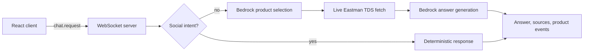
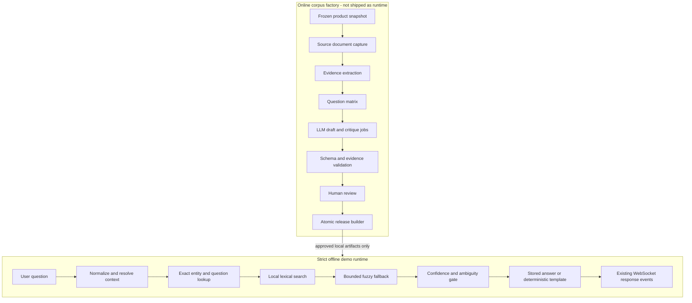

# Offline JSON Q&A Product Finder Plan

## 1. Purpose

The goal is to **“replace the LLM calls with an extensive json search of questions and answers”** and deliver a completely offline proof of concept.

The solution will deliberately separate two systems:

1. **Online corpus factory** — run before a release, with controlled access to Eastman source pages and one or more LLMs. It gathers evidence, creates many questions and subquestions, drafts answers, validates them, and promotes only approved records.
2. **Offline demo runtime** — ships only versioned local JSON/JSONL artifacts and a local lexical search index. It never calls Bedrock, another model, Eastman, or any other remote service while answering a question.

The offline runtime must not contain a hidden online fallback. If it cannot find a sufficiently confident supported answer, it must ask a deterministic clarification question or say that the frozen demo corpus does not contain the answer.

---

## 2. Verified Current State

The executable source code, rather than historical phase documents, is the authority for this plan.

### 2.1 Current request flow

For a product-related message, the current flow is:

1. The browser sends a protocol-v2 `chat.request` over `/ws/chat`.
2. The WebSocket server validates origin, event shape, message size, active-request state, and conversation quota.
3. A deterministic classifier handles greetings and other social messages without a model call.
4. `ChatOrchestrator` sends the user's question, recent conversation context, and all 979 trimmed products to Bedrock to select one or more FGMNs.
5. The runtime fetches and parses selected products' TDS pages from Eastman; SDS is currently represented by a link rather than fetched content.
6. `ChatOrchestrator` sends the selected catalog records and retrieved evidence to Bedrock for a second completion.
7. The response is streamed as `answer.delta` events. Sources and product cards are assembled deterministically and emitted separately.
8. The in-memory conversation store records recent FGMNs and enforces the product-turn limit. A reconnect starts a new server-side conversation.



### 2.2 Runtime network dependencies to remove

- `Backend/src/bedrock/client.js` performs product-selection and answer-generation requests.
- `Backend/src/documents/eastman-document-client.js` downloads TDS content during a chat request.
- `Backend/src/server.js` constructs both online clients at startup.
- `Backend/src/config/env.js` currently requires `BEDROCK_API_KEY`.

Removing only Bedrock is not sufficient: live TDS retrieval also prevents a completely offline demo.

### 2.3 Reusable parts

- Express application and health endpoints.
- WebSocket lifecycle, cancellation, origin checks, event size limits, and protocol envelope.
- Conversation history, recent-product context, product-turn quota, and rollback behavior.
- Deterministic social responses and handoff behavior.
- Product/source event structure and existing product cards.
- Versioned release directories and atomic `artifacts/current.json` pointer updates.
- Existing catalog URL allowlisting and product normalization, where applicable during the build.

### 2.4 Active data limitations

The active release is `20260902T172534143Z-7daaf5c5` and contains:

- 979 products in a roughly 1.5 MB `products.json` file.
- 768 products marked as having TDS documents.
- 965 products marked as having SDS documents.
- 461 products marked as having sales specifications.
- 979 catalog chunks.
- 979 precomputed Gemini vectors in a roughly 9.5 MB file.
- Five facet categories containing 224 values in total.

The release report is `partial`. It warns that facet memberships are not populated and canonical product links are generated fallbacks. These warnings must be resolved or explicitly retained as limitations before generated answers are treated as verified.

The existing embeddings do not make the demo offline-search capable: no local query embedding model exists, and the vectors are not used by the current request path. They should not be shipped in the first offline runtime unless a later, separately approved local embedding phase needs them.

---

## 3. Target Offline Architecture



### 3.1 Hard runtime guarantees

- No Bedrock or other LLM calls.
- No live TDS, SDS, product-page, analytics, font, CDN, or other third-party fetches needed to start or answer.
- No API key required to run the demo.
- No query embeddings generated locally or remotely in phase one.
- No runtime fallback to the online implementation.
- Every factual sentence is either stored in an approved answer or rendered from approved structured evidence.
- Every product and source emitted with an answer is referenced by that answer's approved evidence IDs.
- Unknown, unsupported, and ambiguous questions fail closed.

### 3.2 Runtime components

The runtime will use:

- Exact maps for FGMNs, normalized product names, aliases, and exact question variants.
- A serialized local lexical index, preferably built with MiniSearch, over approved question variants, keywords, answer titles, product names, descriptions, applications, brands, product types, and evidence headings.
- Controlled fuzzy matching supplied by the same search layer for textual tokens only.
- A small deterministic intent and entity resolver.
- A confidence/margin policy that decides whether to answer, clarify, or return no match.
- A deterministic answer renderer for local facts, document listings, product lists, and supported comparisons.

MiniSearch is an implementation recommendation, not a remote service. It can be installed and bundled with the backend; the serialized index and all source records remain local JSON artifacts.

---

## 4. Corpus Design

An “extensive” corpus should provide broad coverage without trying to precompute every possible sentence or product pair. With 979 products, exhaustive pairwise comparisons alone would require 478,731 unordered pairs before question paraphrases. That is expensive to generate, difficult to review, and likely to contain unsupported claims.

The corpus will therefore combine:

1. Complete structured coverage of all products.
2. Canonical, approved Q&A records for common intents.
3. Many query variants that point to the same canonical answer.
4. Curated comparisons for high-value product pairs or families.
5. Deterministic templates for systematic facts and uncurated side-by-side views.

### 4.1 Release file layout

Each publishable release should contain:

| File                | Purpose                                                                                                        |
| ------------------- | -------------------------------------------------------------------------------------------------------------- |
| `manifest.json`     | Release identity, schema versions, source hashes, prompt/model provenance, file hashes, and record counts.     |
| `report.json`       | Build status, validation results, coverage, exclusions, warnings, and evaluation summary.                      |
| `products.json`     | Frozen normalized product records.                                                                             |
| `evidence.jsonl`    | Locally captured and parsed evidence fragments with provenance.                                                |
| `answers.jsonl`     | Approved canonical answers and deterministic answer recipes.                                                   |
| `questions.jsonl`   | Searchable canonical questions, paraphrases, abbreviations, and controlled typo variants mapped to answer IDs. |
| `aliases.json`      | FGMN, product, brand, family, application, property, document, and unit aliases.                               |
| `comparisons.jsonl` | Curated comparison answers and supported pair/group definitions.                                               |
| `search-index.json` | Serialized lexical index produced from the approved records.                                                   |
| `evaluation.json`   | Held-out queries and expected outcomes, or a hash/reference to a non-shipped evaluation set.                   |

Raw LLM responses and review work queues belong in a separate build-only area, not in the runtime release.

### 4.2 Product record

Keep the current normalized fields and add only verified structured attributes extracted during offline ingestion:

```json
{
  "fgmn": "71103853",
  "displayName": "AdapT 100",
  "normalizedName": "adapt 100",
  "aliases": ["adapt100", "adapt 100 solvent"],
  "description": "Approved catalog description",
  "brands": [],
  "productTypes": [],
  "applications": [],
  "availability": [],
  "documents": {
    "hasTds": true,
    "hasSds": true,
    "hasSalesSpecification": false
  },
  "evidenceIds": ["catalog:71103853", "tds:71103853:overview"],
  "canonicalUrls": {
    "detail": "https://...",
    "tds": "https://...",
    "sds": "https://..."
  }
}
```

Canonical remote URLs are provenance metadata. The offline UI must not fetch them automatically. For a strict disconnected demonstration, source buttons should open a local evidence view or be labelled as canonical references that require connectivity.

### 4.3 Evidence record

Evidence is immutable within a release and should be granular enough to support claim checks:

```json
{
  "evidenceId": "tds:71103853:physical-properties",
  "fgmn": "71103853",
  "sourceType": "tds",
  "title": "Physical properties",
  "text": "Normalized captured text",
  "facts": [
    {
      "name": "density",
      "value": "1.04",
      "unit": "g/cm3",
      "qualifiers": []
    }
  ],
  "sourceUrl": "https://...",
  "capturedAt": "ISO-8601 timestamp",
  "sourceSha256": "sha256",
  "parserVersion": 1
}
```

Do not infer missing property values. SDS content should only be stored and redistributed if permissions permit it; otherwise store approved metadata and a deterministic offline explanation that the SDS itself is not packaged.

### 4.4 Canonical answer record

```json
{
  "answerId": "product:71103853:overview:v1",
  "intent": "product_overview",
  "scope": "product",
  "fgmns": ["71103853"],
  "title": "AdapT 100 overview",
  "answer": "Approved answer text.",
  "evidenceIds": ["catalog:71103853", "tds:71103853:overview"],
  "sourceIds": ["product:71103853", "tds:71103853"],
  "keywords": ["selective h2s removal", "mdea", "solvent"],
  "negativeTerms": [],
  "status": "approved",
  "review": {
    "reviewer": "reviewer-id",
    "reviewedAt": "ISO-8601 timestamp",
    "notes": ""
  },
  "provenance": {
    "generationJobId": "job-id",
    "model": "model-id",
    "promptVersion": "answer-v1"
  }
}
```

Only records with `status: "approved"` can enter a runtime release. Answers that are partly deterministic can instead contain a restricted recipe ID and approved fields; they must not contain executable code or free-form templates supplied by the generation model.

### 4.5 Question record

Keep question variants separate from answer text so many phrasings can map to one reviewed answer:

```json
{
  "questionId": "q:product:71103853:overview:0001",
  "answerId": "product:71103853:overview:v1",
  "text": "Tell me about AdapT 100",
  "normalizedText": "tell me about adapt 100",
  "intent": "product_overview",
  "entities": {
    "fgmns": ["71103853"],
    "products": ["adapt 100"]
  },
  "variantType": "paraphrase",
  "locale": "en",
  "status": "approved"
}
```

Generated misspellings must be plausible and bounded. Do not generate fuzzy variants of FGMNs, measurements, CAS-like identifiers, or safety-critical numeric values.

---

## 5. Question Coverage Matrix

### 5.1 Tier A — complete deterministic coverage

Cover all 979 products without requiring thousands of independently authored factual claims:

- Lookup by exact FGMN.
- Lookup by exact and normalized product name.
- Product overview from approved catalog text.
- Document availability: TDS, SDS, and sales specification.
- Locally captured TDS sections and individual structured properties where available.
- Product page and document provenance.
- Known brand, product type, application, and availability memberships once verified.
- Deterministic “information not present in this release” answers for absent fields.

These answers should be rendered from local structured data using fixed, reviewed templates.

### 5.2 Tier B — generated and reviewed product Q&A

For each product with sufficient evidence, generate a bounded set of canonical intents and several paraphrases per intent:

- What the product is.
- Typical uses/applications stated by the source.
- Key features or benefits stated by the source.
- Relevant technical properties.
- Available technical and safety documents.
- Product-identification variants using FGMN, full name, shortened name, and known alias.
- Evidence-supported “is this suitable for X?” questions, phrased carefully so the answer recommends evaluation rather than making unsupported guarantees.
- Evidence-supported alternatives only when relationships are curated.

Do not force every intent onto every product. A coverage record should mark an intent as `supported`, `unsupported`, `not_applicable`, or `needs_review`.

### 5.3 Tier C — discovery and facet Q&A

- Products for a known application.
- Products in a verified product type.
- Products belonging to a known brand/family.
- Availability by known region where the source supports it.
- Document-oriented discovery, such as products with a locally captured TDS.
- Common synonym, acronym, and terminology questions.
- “Show more” and “another option” variants, with deterministic pagination/ranking.

Facet questions must not be published from the current empty memberships. Capture and validate those memberships first.

### 5.4 Tier D — comparisons and alternatives

- Author and review comparisons for demo-critical pairs and product families.
- Create family-level comparison matrices from common verified attributes.
- For an uncurated pair, show a neutral side-by-side table containing only shared, locally verified fields.
- If comparable evidence is insufficient, say so rather than declaring a winner.
- Never generate all 478,731 pair combinations.

### 5.5 Tier E — conversational and failure cases

- Greetings, thanks, help, capabilities, and reset guidance.
- Follow-ups such as “what about its TDS?”, “and the second one?”, and “show another”.
- Ambiguous names, multiple product references, misspellings, and incomplete application descriptions.
- Out-of-domain questions.
- Unsupported regulatory, legal, medical, safety, pricing, inventory, or performance-guarantee requests.
- Prompt-injection attempts and requests to ignore the local evidence.
- Queries containing conflicting product names and FGMNs.

These records are essential for evaluating refusal and clarification behavior, not merely for increasing corpus size.

### 5.6 Practical initial release scope

Before generation, create a dry-run manifest that reports the exact number of planned jobs. A reasonable first release should target:

- 100% deterministic profile and document-availability coverage for 979 products.
- Generated Q&A only where evidence is present and passes extraction validation.
- Deep paraphrase coverage for a curated set of high-value demo products, applications, brands, and product types.
- Curated comparisons for the demo script and common product families.
- A broad held-out set of typos, ambiguous queries, unsupported questions, and follow-ups.

Corpus quality and reviewed evidence coverage are release gates. A large unreviewed answer count is not a success metric.

---

## 6. Online Corpus Factory

All steps in this section happen before packaging the offline demo.

### 6.1 Freeze and identify the source snapshot

1. Select the 979-product local snapshot as the initial demo baseline.
2. Record its SHA-256 and release ID.
3. Do not silently merge the current live product count or newer source pages into that release.
4. Resolve generated product URLs where possible and record unresolved URLs as explicit warnings.
5. Capture facet memberships with reproducible queries, or omit unsupported facet retrieval from the release.
6. Confirm permission to cache and demonstrate source document text.

### 6.2 Capture source documents once

Create a resumable build script that:

- Fetches allowlisted HTTPS Eastman URLs only.
- Applies concurrency, timeout, retry, response-size, and content-type limits.
- Stores raw responses in a build cache keyed by URL and content hash.
- Records status, redirect chain, timestamp, headers needed for provenance, and failures.
- Never overwrites a prior raw capture; changed content creates a new version.
- Supports restart without re-fetching completed unchanged documents.
- Produces a failure report for missing, blocked, or malformed pages.

This script replaces chat-time document fetching. It is not imported by the offline server.

### 6.3 Extract structured evidence

- Reuse and extend the current TDS HTML normalization.
- Split evidence by stable section rather than arbitrary character windows.
- Parse common property/value/unit rows into typed facts while retaining source text.
- Normalize Unicode, whitespace, trademarks, units, and headings without changing values.
- Detect duplicate documents and conflicting values.
- Validate every evidence FGMN against `products.json`.
- Treat parser failures and suspiciously empty documents as review failures.
- Keep SDS handling conservative; do not summarize safety instructions without authoritative, reviewable evidence.

### 6.4 Build the generation matrix

Generate stable job IDs from:

`source release + FGMN/scope + intent + prompt version + model configuration`

Each job contains only the evidence needed for that product or category. The matrix should support:

- Product-level canonical question generation.
- Subquestion generation by supported intent.
- Paraphrase, abbreviation, and common-language variants.
- Category and application questions.
- Curated comparison prompts.
- Negative and ambiguity examples.
- Answer drafting.
- Independent critique against evidence.

A dry run must output planned job counts and estimated tokens before any model is called.

### 6.5 Call models in resumable batches

- Put generation credentials in build-time environment configuration only; never copy them into runtime artifacts or logs.
- Require strict JSON-schema output.
- Set low temperature for factual answers; diversity is useful for question paraphrases, not claims.
- Limit concurrency and implement retry with backoff.
- Append every request metadata record and raw response to JSONL before transformation.
- Resume by stable job ID so partial runs are safe.
- Record model identifier, prompt version, generation parameters, timestamps, token usage, and source evidence IDs.
- Keep failed schema parses in a quarantine queue rather than attempting to salvage prose silently.
- Allow deliberate use of different models/prompts for question generation, answer drafting, and critique.

### 6.6 Prompt constraints

Every factual answer-generation prompt must require the model to:

- Use only supplied evidence.
- Cite evidence IDs for each answer.
- Avoid external knowledge and unstated inference.
- Return `unsupported` when evidence is insufficient.
- Preserve exact product names, FGMNs, numbers, units, qualifiers, and conditions.
- Avoid guarantees and unsupported comparative superlatives.
- Separate factual claims from cautious evaluation guidance.
- Produce no HTML, scripts, links, or executable templates.

### 6.7 Deterministic validation

Reject or quarantine a generated record when:

- It fails the JSON schema.
- Its answer, product, question, or evidence IDs do not exist.
- It cites evidence belonging to a different product.
- It introduces an FGMN, URL, number, unit, or document claim absent from cited evidence.
- Its question variant maps to conflicting answers after normalization.
- It duplicates an existing variant without an explicit resolution.
- It contains forbidden markup, prompt text, secrets, or unsupported status values.
- Its answer is empty, excessively long, or lacks required provenance.

Model critique can prioritize review but cannot replace these checks or human approval.

### 6.8 Human review and promotion

Use a review queue ordered by risk and demo value:

1. Safety, regulatory, suitability, and comparison answers.
2. Answers containing numeric properties or conditions.
3. High-frequency demo products and applications.
4. Remaining product summaries and paraphrases.

Reviewers should see the question, answer, highlighted claims, cited evidence, source snapshot, model metadata, and validation warnings together. They can approve, edit, reject, or mark unsupported. All changes require reviewer identity, timestamp, and an audit record.

Only approved records are copied into publishable artifacts.

### 6.9 Build and activate the release

Extend the existing atomic release pattern:

1. Build into `<release>.tmp`.
2. Validate all files, references, counts, schemas, and hashes.
3. Build the local search index only from approved records.
4. Run the full offline evaluation suite against the temporary release.
5. Write the manifest and report.
6. Rename the completed directory atomically.
7. Update `artifacts/current.json` atomically only after all gates pass.
8. Retain the previous known-good release for rollback.

---

## 7. Offline Query and Ranking Flow

### 7.1 Normalize safely

- Apply Unicode NFKC, lowercase, whitespace collapse, and controlled punctuation normalization.
- Normalize trademark symbols and known unit spellings while preserving the original query.
- Keep numeric tokens intact.
- Expand only reviewed aliases and acronyms.
- Detect exact FGMNs before any fuzzy operation.
- Limit query length and token count using the existing request limits.

### 7.2 Resolve intent and entities

Use deterministic phrase dictionaries and exact maps to identify:

- Product FGMNs, names, and aliases.
- Brands and product families.
- Applications and product types.
- Document requests.
- Property names and units.
- Overview, recommendation, comparison, alternative, list, and follow-up intents.

An unresolved intent can still go to lexical answer search. It must not be guessed solely from a weak fuzzy match.

### 7.3 Use conversation context

Retain the current conversation store and recent FGMNs. For follow-ups:

- “It”, “its”, and “that product” may resolve only when exactly one recent product is salient.
- “The first/second one” resolves against the previous ordered result list.
- Explicit product names or FGMNs override conversation context.
- If two or more recent products make the reference ambiguous, ask which product the user means.
- Clearing or reconnecting resets context, matching current in-memory behavior unless persistence is deliberately added later.

### 7.4 Retrieve in ordered stages

1. **Exact question lookup** — normalized question text maps directly to an approved answer.
2. **Exact entity lookup** — exact FGMN, full product name, or approved alias constrains candidates.
3. **Filtered lexical search** — search question variants and metadata, filtered by resolved entities and intent where reliable.
4. **Product/evidence search** — support discovery and deterministic fact templates when no authored Q&A is needed.
5. **Bounded fuzzy fallback** — enable only for sufficiently long textual terms and known names; never fuzz numeric identifiers or measurements.

Recommended lexical field weighting, to be tuned on the evaluation set:

1. Exact normalized question and FGMN.
2. Product full name and aliases.
3. Intent and canonical question.
4. Application, brand, and product type.
5. Keywords and evidence headings.
6. Description/evidence body text.

Recent-product context may boost candidates but must never overpower an explicit different product in the current query.

### 7.5 Confidence and ambiguity gate

Do not expose raw search score as confidence. Calibrate answer policy using held-out queries and require both:

- A minimum score appropriate to the retrieval path.
- A sufficient margin between the first and second eligible candidates.

Outcomes:

- `matched` — one supported answer clearly wins.
- `clarification` — likely intent/product exists, but candidates are ambiguous.
- `no_match` — no supported answer crosses the release threshold.
- `unsupported` — the subject is recognized but the requested claim is absent or disallowed.
- `social` — deterministic conversational response.

Thresholds should be stored in the release or runtime configuration with their evaluation version. They must be tuned from measured results, not chosen from intuition alone.

### 7.6 Render without generating new claims

The renderer may:

- Return approved answer text verbatim.
- Fill fixed templates with allowlisted structured fields.
- Produce a neutral list of matched products with stored snippets.
- Produce a side-by-side table from the intersection of verified properties.
- Add deterministic caveats and local-corpus freshness information.

The renderer may not summarize arbitrary retrieved paragraphs, invent transitions that add meaning, or combine claims without an approved recipe.

Return product cards and sources only for the selected approved answer. Never attach the top lexical product merely because it appeared in candidate search.

### 7.7 Clarification and no-match responses

Examples of deterministic behavior:

- Ambiguous product: “I found multiple matching products. Choose one: …”
- Missing context: “Which product do you mean?”
- Unsupported property: “The offline release does not contain that property for AdapT 100.”
- Out of scope: “This offline demo searches its frozen Eastman product Q&A corpus only.”
- Low confidence: suggest up to three clearly labelled product/name/application queries, but do not present them as the answer.

---

## 8. Application Changes

### 8.1 Backend modules to add

Suggested boundaries:

- `Backend/src/offline/schema.js` — strict runtime artifact schemas.
- `Backend/src/offline/load-release.js` — load, hash-check, and cross-reference all offline files.
- `Backend/src/offline/search-index.js` — deserialize/build the local lexical index.
- `Backend/src/offline/query-normalizer.js` — deterministic query normalization.
- `Backend/src/offline/entity-resolver.js` — exact entities, aliases, intents, and context references.
- `Backend/src/offline/retriever.js` — staged exact/lexical/fuzzy candidate retrieval.
- `Backend/src/offline/confidence.js` — calibrated match/clarify/no-match policy.
- `Backend/src/offline/answer-renderer.js` — approved answers and restricted templates.
- `Backend/src/chat/offline-orchestrator.js` — maintain the current `answer()` contract for WebSocket integration.

Module names can be adjusted to project conventions, but build-only code and runtime code must remain clearly separated.

### 8.2 Build-only modules/scripts to add

- Source capture and cache script.
- Evidence extractor.
- Question-matrix planner and dry-run reporter.
- Resumable LLM batch runner.
- Raw-output validator and quarantine writer.
- Review import/export tooling.
- Search-index builder.
- Offline release publisher.
- Coverage and evaluation reporter.

Build scripts may import the current Bedrock and Eastman clients. Runtime modules may not.

### 8.3 Existing modules to change

- `Backend/src/server.js`
  - Load the offline release and offline orchestrator.
  - Stop constructing `BedrockClient` and `EastmanDocumentClient`.
- `Backend/src/config/env.js`
  - Remove `BEDROCK_API_KEY` from runtime-required configuration.
  - Keep generation credentials in a separate build-script configuration path.
  - Optionally use an explicit `CHAT_MODE=offline`, but production POC startup must not silently switch modes.
- `Backend/src/corpus/load-release.js`
  - Validate schemas, file hashes, answer/evidence references, release status, and index compatibility.
- `Backend/src/websocket/chat-server.js`
  - Preserve event types, quotas, cancellation, and error isolation.
  - Replace model-specific error classification with offline load/search error categories.
- Protocol and frontend progress labels
  - Keep the protocol-v2 envelope where possible.
  - Replace misleading “generating” language with “matching” or “preparing answer”.
  - Emit a stored answer in one delta or deterministic chunks without artificial model latency.
- Frontend source rendering
  - Do not automatically contact remote source URLs.
  - Add a local evidence view or clearly mark canonical external links as unavailable offline.

### 8.4 Online code retirement

After offline parity is accepted:

- Move Bedrock and live document retrieval behind build-only entry points, or remove them from the runtime package.
- Add an automated architecture test that fails if runtime modules import build-only clients.
- Remove runtime Bedrock environment documentation.
- Exclude raw captures, generation logs, credentials, and unnecessary embeddings from the deployable demo bundle.

---

## 9. Testing and Evaluation

### 9.1 Unit tests

- Query normalization, including trademarks, punctuation, whitespace, and units.
- Exact FGMN/name/alias lookup.
- Fuzzy boundaries and the prohibition on numeric fuzzing.
- Intent/entity extraction.
- Context resolution and ambiguity.
- Search field weighting and deterministic tie-breaking.
- Confidence and margin outcomes.
- Restricted answer rendering.
- Schema, hash, duplicate, and cross-reference validation.
- Source/product attachment from answer evidence only.

### 9.2 Golden retrieval set

Create a reviewed test set that is not copied directly from generated training variants. Include:

- Exact questions.
- Human-written paraphrases.
- Common misspellings.
- FGMN and product-name queries.
- Application/category discovery.
- Follow-ups with and without valid context.
- Ambiguous queries.
- Unsupported properties and comparisons.
- Out-of-domain and adversarial prompts.

Track at least:

- Exact-map accuracy.
- Answer top-1 accuracy.
- Product recall at 1 and 3 for discovery.
- Clarification accuracy.
- No-answer precision and recall.
- Wrong-product answer rate.
- Unsupported-claim and invalid-source counts.

Initial release targets should include 100% exact FGMN/name behavior, zero known invalid references or unsupported numeric claims, and agreed measured thresholds for the remaining metrics. Numeric targets must be set after a representative golden set exists.

### 9.3 Integration and protocol tests

- Replace the current two-model-call orchestrator tests with offline exact, lexical, fuzzy, context, clarification, and no-match cases.
- Preserve WebSocket lifecycle tests for `connection.ready`, snapshots, accepted/progress events, answer deltas, sources, products, completion, cancellation, and quota.
- Verify social messages do not consume product quota.
- Verify the default runtime allowance remains 20 product turns unless product requirements change it.
- Verify reconnect/reset semantics explicitly.
- Verify unsafe source URLs and unexpected local evidence paths are rejected.

### 9.4 No-network proof

Automate a test that starts the backend with:

- No Bedrock API key.
- `global.fetch` replaced with a function that fails every call.
- Outbound socket connection attempts blocked or instrumented to fail, excluding the local test server.
- DNS/network unavailable where CI or the demo environment permits.

Then run representative exact, lexical, fuzzy, follow-up, comparison, and no-match conversations. The browser network log during the final demo must show only local HTTP/WebSocket traffic. The test must also search the runtime dependency graph for imports of Bedrock and the live Eastman document client.

### 9.5 Performance tests

Measure rather than assume:

- Startup time and index deserialization time.
- Runtime memory with the complete approved corpus.
- Search latency distribution for the golden set.
- Release bundle size.
- Worst-case fuzzy query latency.

Define the demo's reference hardware, then set a local target such as sub-100 ms p95 retrieval only after obtaining a baseline. Store measured results and environment details in `report.json`.

### 9.6 Regression and content tests

- Every answer/evidence/product/source reference resolves.
- Every manifest file hash matches.
- No unapproved record is indexed.
- No duplicate normalized question maps silently to conflicting answers.
- Product names, FGMNs, numeric values, and units in answers match cited evidence.
- Removed or changed source content invalidates affected answers in the next release.
- The previous release remains loadable for rollback.

---

## 10. Delivery Phases and Exit Criteria

### Phase 0 — baseline and demo contract

**Work**

- Freeze the 979-product snapshot.
- Approve the strict definition of offline.
- Choose the high-value demo products, applications, and comparisons.
- Record baseline questions and current expected user flows.

**Exit criteria**

- Snapshot hash and limitations are documented.
- Demo script and initial golden queries are approved.
- No ambiguity remains about external source-link behavior in offline mode.

### Phase 1 — evidence release

**Work**

- Capture product/TDS sources.
- Populate or explicitly exclude facet memberships.
- Extract structured evidence and provenance.
- Resolve canonical-link warnings where possible.

**Exit criteria**

- Every retained evidence record passes schema and hash validation.
- Capture failures and content-rights restrictions are reported.
- No answer generation begins from untracked source text.

### Phase 2 — Q&A factory

**Work**

- Implement the question matrix, dry run, batch generation, raw append-only logs, deterministic validation, and review queues.
- Generate product questions, subquestions, paraphrases, categories, selected comparisons, and negative cases.

**Exit criteria**

- Jobs are resumable and reproducible by stable ID.
- All model output has provenance.
- Only schema-valid records enter review.
- No credentials appear in artifacts or logs.

### Phase 3 — reviewed offline corpus

**Work**

- Review and promote records.
- Build exact maps, aliases, and the serialized lexical index.
- Produce coverage and conflict reports.

**Exit criteria**

- Runtime artifacts contain approved records only.
- All references and hashes validate.
- High-value demo scenarios have reviewed coverage.
- Ambiguous normalized questions have explicit resolutions.

### Phase 4 — offline runtime integration

**Work**

- Implement deterministic normalization, entity resolution, retrieval, confidence, and rendering.
- Replace the runtime orchestrator wiring.
- Preserve WebSocket and frontend behavior while correcting progress labels.
- Add local source evidence presentation.

**Exit criteria**

- Backend starts without model credentials.
- Product requests make no remote calls.
- Exact, lexical, fuzzy, context, clarification, and no-match paths work end to end.
- Product cards and sources match approved answer records.

### Phase 5 — hardening and acceptance

**Work**

- Run unit, integration, frontend, golden-set, performance, and no-network tests.
- Test on the actual disconnected demo machine.
- Package the release and document rollback.

**Exit criteria**

- All backend and frontend tests pass.
- No-network proof passes with representative conversations.
- Zero known broken references, unsupported numeric claims, or unapproved indexed records.
- Golden-set results meet agreed thresholds.
- The previous release can be restored by changing the atomic pointer.

### Phase 6 — optional coverage expansion

After the POC is accepted, expand based on real unanswered-query logs collected with consent and without sensitive data. New queries go through the same evidence, generation, validation, review, evaluation, and release process. Do not learn directly into the active runtime corpus.

---

## 11. Risks and Mitigations

| Risk                                                   | Mitigation                                                                                                                  |
| ------------------------------------------------------ | --------------------------------------------------------------------------------------------------------------------------- |
| Corpus grows without improving answer quality          | Track held-out accuracy, no-answer behavior, reviewed coverage, and duplicate rates rather than raw record count.           |
| Model-generated claims are unsupported                 | Evidence-only prompts, exact value checks, quarantine, and human approval.                                                  |
| Fuzzy matching returns a confidently wrong product     | Exact/entity stages first, no numeric fuzzing, conservative thresholds, score-margin gate, and clarification.               |
| Product/facet data is incomplete                       | Preserve release warnings, omit unsupported facets, and never infer memberships.                                            |
| Cached documents become stale                          | Display release date, retain source hashes, recapture on a schedule, and invalidate affected answers when evidence changes. |
| “Offline” still triggers browser requests              | Bundle all assets, block automatic external links/fetches, and prove with disconnected browser tests.                       |
| Exhaustive comparisons become unmanageable             | Curate important pairs and use neutral structured side-by-side templates for the rest.                                      |
| Build credentials leak into the demo                   | Separate build/runtime configuration and packages; scan output artifacts and logs.                                          |
| Search behavior changes between releases               | Version tokenizer, aliases, index format, thresholds, and evaluation results in the manifest.                               |
| User treats the demo as current authoritative guidance | Display snapshot date and limitations; use deterministic safety/regulatory disclaimers and no-answer behavior.              |

---

## 12. Definition of Done

The offline POC is complete when:

- The server and frontend start with no Bedrock key and no internet connection.
- Runtime code does not instantiate or import model or live document clients.
- The browser uses only local assets, HTTP endpoints, and WebSocket connections during normal use.
- All responses come from approved local answers or restricted deterministic templates over approved local evidence.
- Exact product/FGMN queries, common paraphrases, misspellings, discovery, selected comparisons, and supported follow-ups pass the golden set.
- Ambiguous and unsupported requests clarify or fail closed rather than returning the nearest unrelated answer.
- Every displayed fact, source, and product can be traced to the active release.
- Release artifacts are schema-validated, hash-verified, atomically activated, and rollback-capable.
- Content generation is reproducible, resumable, auditable, and entirely outside the runtime request path.
